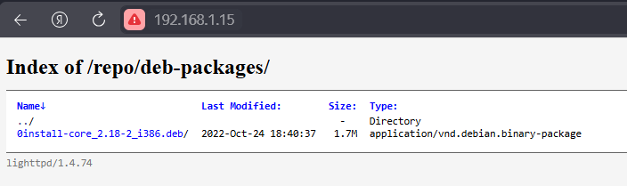

# Управление пакетами. Дистрибьюция софта
## Планирование репозтория
### Версия linux
```
root@helloubuntu:~# lsb_release -a
Distributor ID: Ubuntu
Description:    Ubuntu 24.04.2 LTS
Release:        24.04
Codename:       noble
```
### Необходимые пакеты 
 - lighttpd
 - GPG
 - dpkg-dev
### [Скрипт](/usr/bin/update-repo.sh) для генерации/обновления репозитория

## Установка пакета dpkg-dev:
```
root@helloubuntu:~# apt-get install dpkg-dev
```
### Установка web сервера
```
root@helloubuntu:~# apt-get install lighttpd
```
### Включение отображения списка файлов в каталогах веб-сервера Lighttpd(по умолчанию выключено вернет код 403) 
```
root@helloubuntu:~# echo 'server.dir-listing = "enable"' > /etc/lighttpd/conf-enabled/dir-listing.conf
```
### Перезапуск start lighhttpd и включение автозагрузки
```
root@helloubuntu:~# systemctl restart lighttpd
root@helloubuntu:~# systemctl enable lighttpd
```
### Создание директории для репозитория
```
root@helloubuntu:~# mkdir -p /var/www/html/repo/deb-packages/
```
### Загрузка пакета (брал первый попавшийся с debian.org)
```
root@helloubuntu:~# ls /var/www/html/repo/deb-packages
root@helloubuntu:~# cd /var/www/html/repo/deb-packages
root@helloubuntu:/var/www/html/repo/deb-packages# wget http://ftp.us.debian.org/debian/pool/main/z/zeroinstall-injector/0install-core_2.18-2_i386.deb
```
## Генерация GPG ключа
```
root@helloubuntu:~# gpg --list-keys
gpg: directory '/root/.gnupg' created
gpg: keybox '/root/.gnupg/pubring.kbx' created
gpg: /root/.gnupg/trustdb.gpg: trustdb created
```
## Создаем скрипт генерации ключей 
```
root@helloubuntu:~# cat >~/.gnupg/aptRepo <<EOF
%echo Generating a basic OpenPGP key
Key-Type: RSA
Key-Length: 3072
Subkey-Type: ELG-E
Subkey-Length: 3072
Name-Real: Anton
Name-Comment: without passphrase
Name-Email: hellotony@email.com
Expire-Date: 0
%echo done
EOF
```
## Создание ключа. Пароль для ключей не устанавливается.
```
root@helloubuntu:~# gpg --batch --gen-key ~/.gnupg/aptRepo
gpg: Generating a basic OpenPGP key
gpg: done
gpg: directory '/root/.gnupg/openpgp-revocs.d' created
gpg: revocation certificate stored as '/root/.gnupg/openpgp-revocs.d/B5573C41438B44940861A54FDB49F83CB008892D.rev'
```
## Экспортирование ключа
```
root@helloubuntu:~# gpg --export -a B5573C41438B44940861A54FDB49F83CB008892D > /var/www/html/repo/hellotony.gpg
```
## Запуск нашего скрипта
```
root@helloubuntu:~# /usr/bin/update-repo.sh
```
## Проверка 
### CURL'ом
```
root@helloubuntu:/var/www/html/repo/deb-packages# curl localhost/repo/deb-packages/
# Выведет много строк HTML(вставлять не стал, что бы не мусорить)
```
### Через браузер


