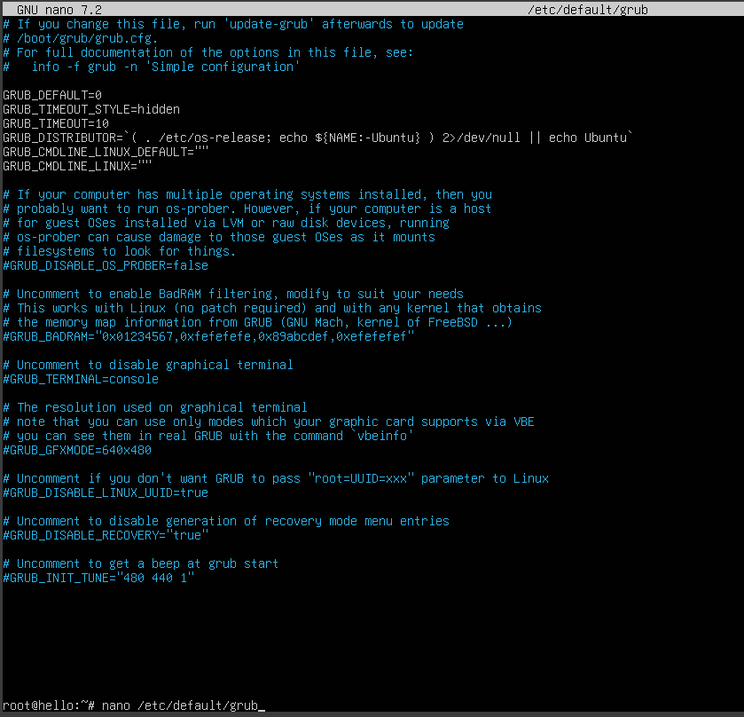
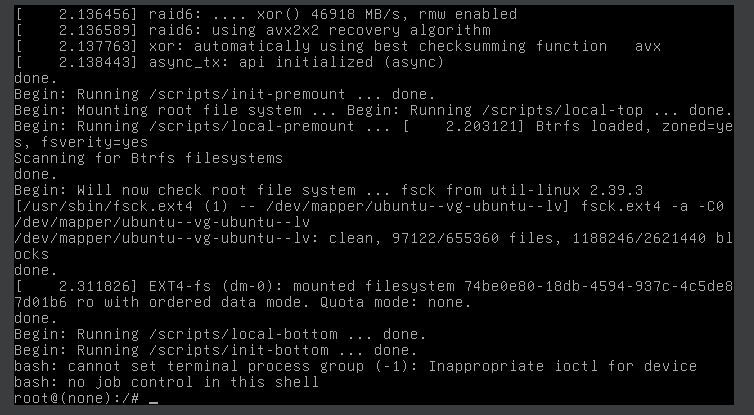
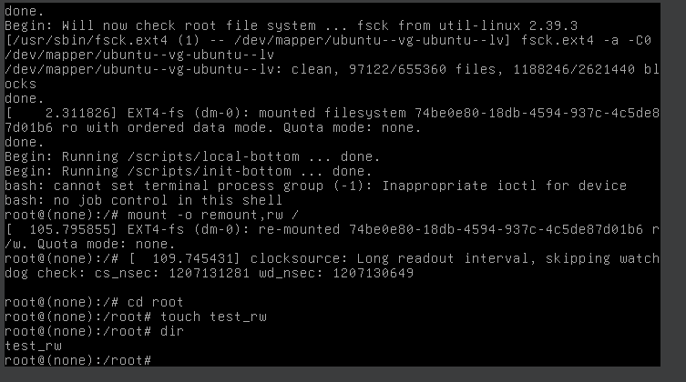
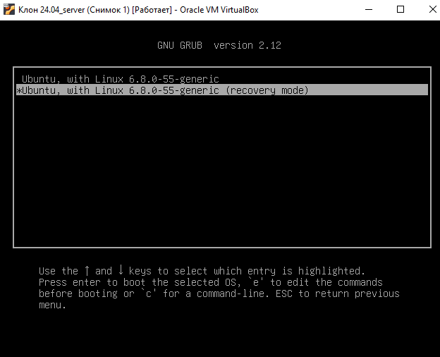
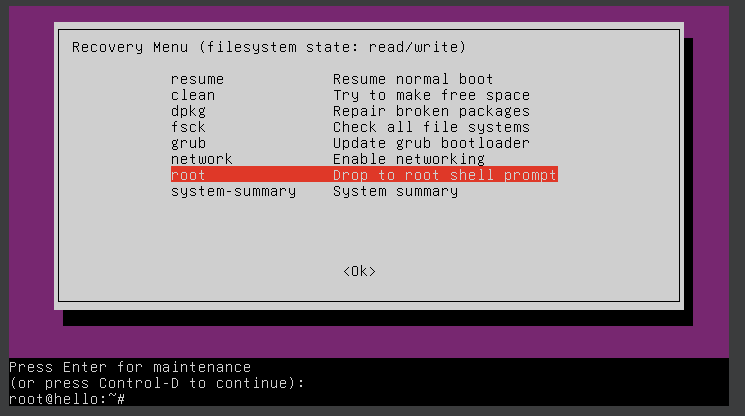
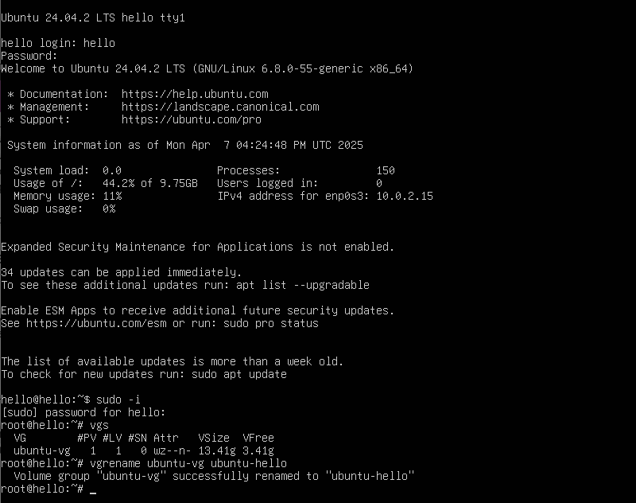
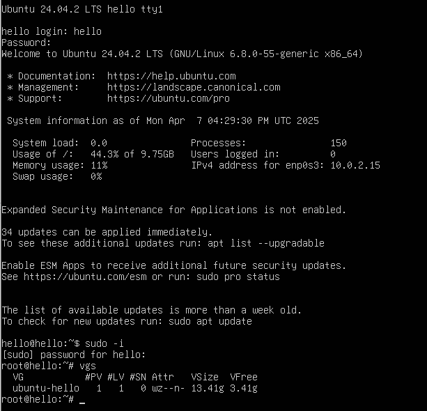

# Загрузка Linux
Необходимо попасть в систему без пароля несколькими способами.
## Способ 1. init=/bin/sh
###Редактируем конфигурационный файл загрузчика 

root@hello:~# nano /etc/default/grub

Комментируем строку, скрывающую меню и ставим задержку для выбора пункта меню в 10 секунд.

#GRUB_TIMEOUT_STYLE=hiddеn

GRUB_TIMEOUT=10

Обновляем конфигурацию загрузчика и перезагружаемся для проверки.

root@hello:~# update-grub

root@hello:~# reboot

При загрузке в окне виртуальной машины мы должны увидеть меню загрузчика. При выборе ядра для загрузки нажать e.
В конце строки, начинающейся с linux, добавляем init=/bin/bash и нажимаем сtrl-x для загрузки в систему

Рутовая файловая система при этом монтируется в режиме Read-Only. Воспользуемся командой что бы перейти в режим Read-Write.

root@hello:~# mount -o remount,rw /

После чего создадим файл, для проверки прав на запись 

## Способ 2. Recovery mode
В меню загрузчика на первом уровне выбрать второй пункт (Advanced options…)

Включаем поддержку сети (network)

Выбираем пункт root и попадаем в консоль с пользователем root. 

Производим любые манипуляции с системой.

# Переименовываем VG

Смотрим текущее состояние системы (список Volume Group)

root@hello:~# vgs

Переименовываем

root@hello:~# vgrename ubuntu-vg ubuntu-hello

Правим /boot/grub/grub.cfg

С помощью сочетания клавиш Alt+R вы можете использовать поиск и замену: ubuntu--vg на ubuntu--hello

Перезагружаемся и проверяем 
root@hello:~# vgs

