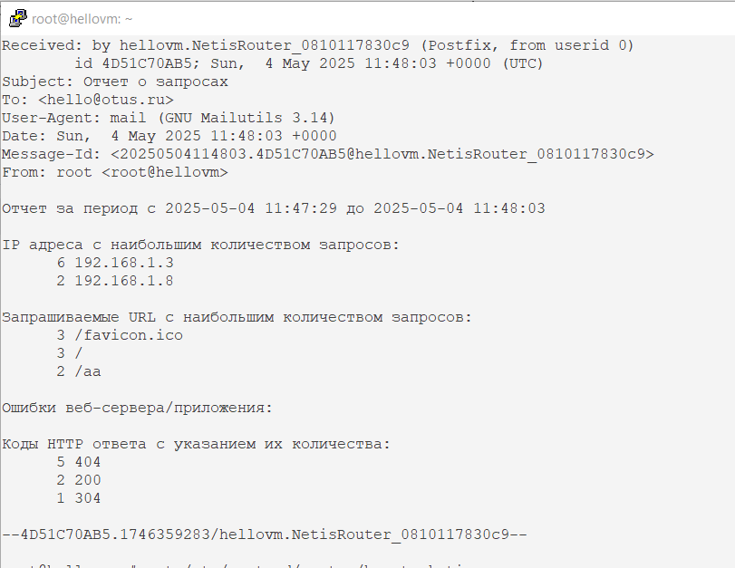

# Написать скрипт на языке Bash
По заданию заменил cron на systemd timer.
##### Дальнейшие действия выполняются от пользователя root. Переходим в root пользователя: sudo -i
## Шаг 1 Установка mailutils (выбрал вариант local mailbox)
```
root@hellovm:~# apt install mailutils
```
## Шаг 2 Создание BASH-скрипта (выбрал путь /var/log/)
```
root@hellovm:~# cat /var/log/monitor.sh
#!/bin/bash

# Определение пути к журналу запросов веб-сервера
LOG_FILE="/var/log/nginx/access.log"  # Журналы
ERROR_LOG="/var/log/nginx/error.log"   # Ошибки
LAST_RUN_FILE="/tmp/last_run_time.txt" # Последний запуск
OUTPUT_FILE="/tmp/report.txt" # Отчет
EMAIL="hello@otus.ru" # Почта для mailutils

# Запрет на одновременный запуск, простая проверка, файлик создан - скрипт запущен
if [ -f "/tmp/monitor_requests.lock" ]; then
    echo "Скрипт уже запущен."
    exit 1
fi

touch /tmp/monitor_requests.lock

# Время последнего запуска
if [ -f $LAST_RUN_FILE ]; then
    LAST_RUN=$(cat $LAST_RUN_FILE)
else
    LAST_RUN="2025-05-04 00:00:00"  # Начальное время
fi

# Обновление времени последнего запуска
date +"%Y-%m-%d %H:%M:%S" > $LAST_RUN_FILE

# Формирование отчета
echo "Отчет за период с $LAST_RUN до $(date +"%Y-%m-%d %H:%M:%S")" > $OUTPUT_FILE

# Список IP адресов с наибольшим количеством запросов
echo -e "\nIP адреса с наибольшим количеством запросов:" >> $OUTPUT_FILE
awk -v last_run="$LAST_RUN" '$4 >= last_run {print $1}' $LOG_FILE | sort | uniq -c | sort -nr | head -n 10 >> $OUTPUT_FILE

# Список запрашиваемых URL
echo -e "\nЗапрашиваемые URL с наибольшим количеством запросов:" >> $OUTPUT_FILE
awk -v last_run="$LAST_RUN" '$4 >= last_run {print $7}' $LOG_FILE | sort | uniq -c | sort -nr | head -n 10 >> $OUTPUT_FILE

# Ошибки веб-сервера/приложения
echo -e "\nОшибки веб-сервера/приложения:" >> $OUTPUT_FILE
awk -v last_run="$LAST_RUN" '$4 >= last_run && $9 ~ /^4|^5/ {print $0}' $ERROR_LOG >> $OUTPUT_FILE

# Список всех кодов HTTP ответа
echo -e "\nКоды HTTP ответа с указанием их количества:" >> $OUTPUT_FILE
awk -v last_run="$LAST_RUN" '$4 >= last_run {print $9}' $LOG_FILE | sort | uniq -c | sort -nr >> $OUTPUT_FILE

# Отправка почты
mail -s "Отчет о запросах" $EMAIL < $OUTPUT_FILE

# Удаление файла блокировки
rm /tmp/monitor_requests.lock
```
## Шаг 3 Создание таймера и сервиса
```
root@hellovm:~# cat /etc/systemd/system/hometask.timer
[Unit]
Description=Load nginx log parser service every 30 second

[Timer]
OnUnitActiveSec=30
AccuracySec=1us
Unit=hometask.service

[Install]
WantedBy=multi-user.target
root@hellovm:~# cat /etc/systemd/system/hometask.service
[Unit]
Description=Nginx log parser service

[Service]
Type=oneshot
User=root
ExecStart=/bin/bash /var/log/monitor.sh

[Install]
 WantedBy=multi-user.target
```
## Шаг 4 Проверка срабатывания (в папке attach в файле mail_report.txt полный вывод)

