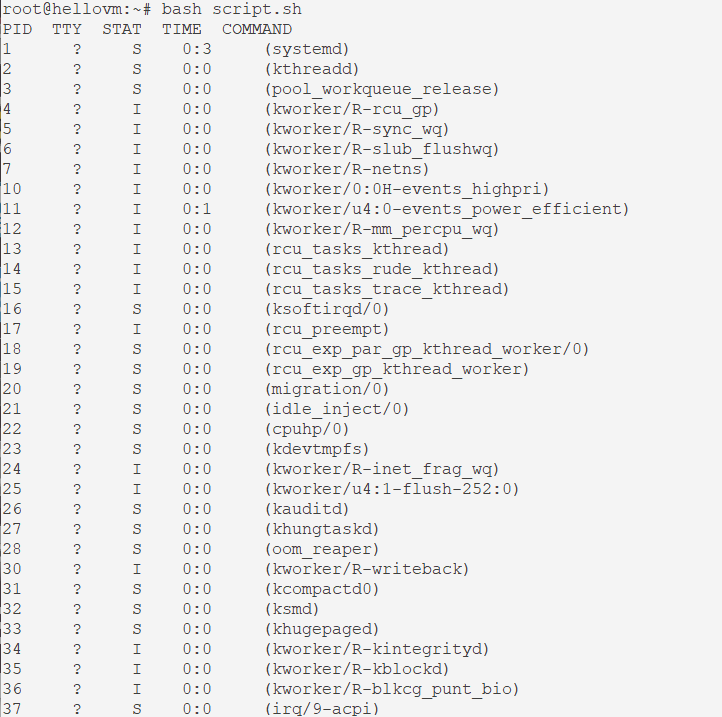

# Написать свою реализацию ps ax используя анализ /proc
## Пишем скрипт 
hello@hellovm:~$ sudo -i
root@hellovm:~# touch script.sh
root@hellovm:~# nano script.sh 
```
#!/bin/bash

# эта переменная нужна для расчета времени ЦПУ
# подсмотрено на просторах интеренета https://stackoverflow.com/questions/16726779/how-do-i-get-the-total-cpu-usage-of-an-application-from-proc-pid-stat
clk=$(getconf CLK_TCK)

# Заголовок для вывода
echo "PID|TTY|STAT|TIME|COMMAND" | column -t -s "|";
# пишем нашу функцию
psax() {
# Обходим все каталоги в /proc, и сортируем их в порядке возрастания
for pid in $(ls /proc | grep -E "^[0-9]+$" | sort -n); do
# Проверяем на существование файл, а затем получаем необходимые нам значенияя.
# значения находим в man proc
        if [ -e /proc/$pid/stat ]; then
                comm=$(cat /proc/$pid/stat | awk -F" " '{print $2}')
                state=$(cat /proc/$pid/stat | awk -F" " '{print $3}')
                tty_nr=$(cat /proc/$pid/stat | awk -F" " '{print $7}')
# Тут нас ждет сюрприз, tty_nr возвращает число
# дискрипторы лежат в /proc/$pid/fd, этим и воспользуемся.
# Сравниваем с 0, если да, то ставим ?, или грепаем дискриптор и выводим значение.
                [[ $tty_nr -eq 0 ]] && tty='?' || tty=$(ls -l /proc/$pid/fd/ | grep -E 'tty|pts' | awk -F"/" '{print $3  $4}' | uniq)
# Решение, найдено в интернете, добавил только часы минутки.                
                utime=$(cat /proc/$pid/stat | awk -F" " '{print $14}')
                stime=$(cat /proc/$pid/stat | awk -F" " '{print $15}')
                total_time=$((utime + stime))
                time=$((total_time / clk))
                in_hour=$((time / 60))
                in_min=$((time - (in_hour * 60)))
                work_time="$in_hour:$in_min"
                echo "${pid}|${tty}|${state}|${work_time}|${comm}"
        fi
done
}
psax | column -t -s "|"
```
## Предоставляем права на чтение, запись и выполнение файла.  
root@hellovm:~# chmod 777 script.sh 
## Запускаем скрипт
root@hellovm:~# bash script.sh 
## Смотрим результат

##
