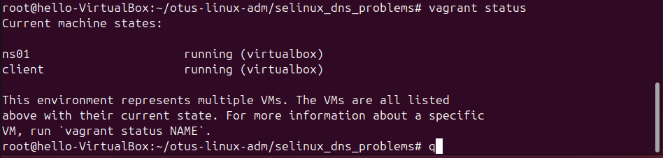
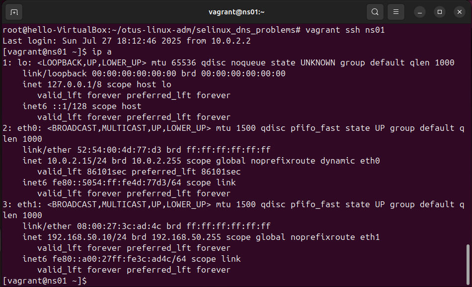
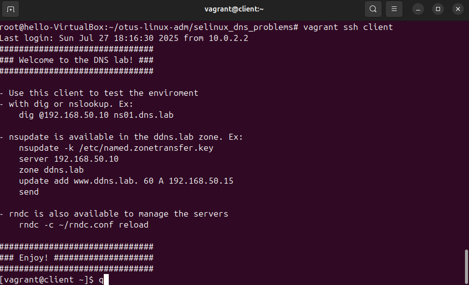

# 1 Часть
## Проверить, что конфигурация nginx настроена без ошибок
```
[root@localhost ~]# nginx -t
```
## C помощью утилиты audit2why смотрим грепал по 4881 порту
```
[root@localhost ~]# grep 4881 /var/log/audit/audit.log | audit2why
type=AVC msg=audit(1753032326.308:138): avc:  denied  { name_bind } for  pid=2235 comm="nginx" src=4881 scontext=system_u:system_r:httpd_t:s0 tcontext=system_u:object_r:unreserved_port_t:s0 tclass=tcp_socket permissive=0

        Was caused by:
        The boolean nis_enabled was set incorrectly.
        Description:
        Allow nis to enabled

        Allow access by executing:
        # setsebool -P nis_enabled 1
```
## Включим параметр nis_enabled и перезапустим nginx:
```
[root@localhost ~]# setsebool -P nis_enabled on
[root@localhost ~]# systemctl restart nginx
[root@localhost ~]# systemctl status nginx
● nginx.service - The nginx HTTP and reverse proxy server
     Loaded: loaded (/usr/lib/systemd/system/nginx.service; disabled; preset: disabled)
     Active: active (running) since Sun 2025-07-20 20:31:31 MSK; 4s ago
    Process: 2285 ExecStartPre=/usr/bin/rm -f /run/nginx.pid (code=exited, status=0/SUCCESS)
    Process: 2286 ExecStartPre=/usr/sbin/nginx -t (code=exited, status=0/SUCCESS)
    Process: 2287 ExecStart=/usr/sbin/nginx (code=exited, status=0/SUCCESS)
   Main PID: 2288 (nginx)
      Tasks: 9 (limit: 97860)
     Memory: 7.6M
        CPU: 40ms
     CGroup: /system.slice/nginx.service
             ├─2288 "nginx: master process /usr/sbin/nginx"
             ├─2289 "nginx: worker process"
             ├─2290 "nginx: worker process"
             ├─2291 "nginx: worker process"
             ├─2292 "nginx: worker process"
             ├─2293 "nginx: worker process"
             ├─2294 "nginx: worker process"
             ├─2295 "nginx: worker process"
             └─2296 "nginx: worker process"

июл 20 20:31:31 localhost.localdomain systemd[1]: Starting The nginx HTTP and reverse proxy server...
июл 20 20:31:31 localhost.localdomain nginx[2286]: nginx: the configuration file /etc/nginx/nginx.conf syntax is ok
июл 20 20:31:31 localhost.localdomain nginx[2286]: nginx: configuration file /etc/nginx/nginx.conf test is successful
июл 20 20:31:31 localhost.localdomain systemd[1]: Started The nginx HTTP and reverse proxy server.
```
## Проверим работу nginx
```
[root@localhost ~]# curl http://127.0.0.1:4881

<!DOCTYPE html PUBLIC "-//W3C//DTD XHTML 1.1//EN" "http://www.w3.org/TR/xhtml11/DTD/xhtml11.dtd">

<html xmlns="http://www.w3.org/1999/xhtml" xml:lang="en">
        <head>
                <title>Test Page for the HTTP Server on AlmaLinux</title>
                <meta http-equiv="Content-Type" content="text/html; charset=UTF-8" />
                <style type="text/css">
                        /*<
## Вернём запрет работы nginx на порту 4881 обратно
```
[root@localhost ~]# getsebool -a | grep nis_enabled
nis_enabled --> on
[root@localhost ~]# setsebool -P nis_enabled off
```
## Разрешим в SELinux работу nginx на порту TCP 4881 c помощью добавления нестандартного порта в имеющийся тип:
```
[root@localhost ~]# semanage port -l | grep http
http_cache_port_t              tcp      8080, 8118, 8123, 10001-10010
http_cache_port_t              udp      3130
http_port_t                    tcp      80, 81, 443, 488, 8008, 8009, 8443, 9000
pegasus_http_port_t            tcp      5988
pegasus_https_port_t           tcp      5989

[root@localhost ~]# semanage port -a -t http_port_t -p tcp 4881
[root@localhost ~]# semanage port -l | grep  http_port_t
http_port_t                    tcp      4881, 80, 81, 443, 488, 8008, 8009, 8443, 9000
pegasus_http_port_t            tcp      5988
```
```
[root@selinux ~]# systemctl restart nginx
[root@selinux ~]# systemctl status nginx

[root@localhost ~]#  systemctl status nginx
● nginx.service - The nginx HTTP and reverse proxy server
     Loaded: loaded (/usr/lib/systemd/system/nginx.service; disabled; preset: disabled)
     Active: active (running) since Sun 2025-07-20 20:36:11 MSK; 15s ago
    Process: 2383 ExecStartPre=/usr/bin/rm -f /run/nginx.pid (code=exited, status=0/SUCCESS)
    Process: 2384 ExecStartPre=/usr/sbin/nginx -t (code=exited, status=0/SUCCESS)
    Process: 2385 ExecStart=/usr/sbin/nginx (code=exited, status=0/SUCCESS)
   Main PID: 2386 (nginx)
      Tasks: 9 (limit: 97860)
     Memory: 7.3M
        CPU: 17ms
     CGroup: /system.slice/nginx.service
             ├─2386 "nginx: master process /usr/sbin/nginx"
             ├─2387 "nginx: worker process"
             ├─2388 "nginx: worker process"
             ├─2389 "nginx: worker process"
             ├─2390 "nginx: worker process"
             ├─2391 "nginx: worker process"
             ├─2392 "nginx: worker process"
             ├─2393 "nginx: worker process"
             └─2394 "nginx: worker process"

июл 20 20:36:11 localhost.localdomain systemd[1]: Starting The nginx HTTP and reverse proxy server...
июл 20 20:36:11 localhost.localdomain nginx[2384]: nginx: the configuration file /etc/nginx/nginx.conf syntax is ok
июл 20 20:36:11 localhost.localdomain nginx[2384]: nginx: configuration file /etc/nginx/nginx.conf test is successful
июл 20 20:36:11 localhost.localdomain systemd[1]: Started The nginx HTTP and reverse proxy server.
```
```
[root@localhost ~]# semanage port -d -t http_port_t -p tcp 4881
[root@localhost ~]# semanage port -l | grep  http_port_t
http_port_t                    tcp      80, 81, 443, 488, 8008, 8009, 8443, 9000
pegasus_http_port_t            tcp      5988
[root@localhost ~]# systemctl restart nginx

Job for nginx.service failed because the control process exited with error code.
See "systemctl status nginx.service" and "journalctl -xeu nginx.service" for details.
[root@localhost ~]#
[root@localhost ~]# systemctl status nginx
× nginx.service - The nginx HTTP and reverse proxy server
     Loaded: loaded (/usr/lib/systemd/system/nginx.service; disabled; preset: disabled)
     Active: failed (Result: exit-code) since Sun 2025-07-20 20:37:57 MSK; 6s ago
   Duration: 1min 40.946s
    Process: 2411 ExecStartPre=/usr/bin/rm -f /run/nginx.pid (code=exited, status=0/SUCCESS)
    Process: 2413 ExecStartPre=/usr/sbin/nginx -t (code=exited, status=1/FAILURE)
        CPU: 20ms

июл 20 20:37:57 localhost.localdomain systemd[1]: Starting The nginx HTTP and reverse proxy server...
июл 20 20:37:57 localhost.localdomain nginx[2413]: nginx: the configuration file /etc/nginx/nginx.conf syntax is ok
июл 20 20:37:57 localhost.localdomain nginx[2413]: nginx: [emerg] bind() to 0.0.0.0:4881 failed (13: Permission denied)
июл 20 20:37:57 localhost.localdomain nginx[2413]: nginx: configuration file /etc/nginx/nginx.conf test failed
июл 20 20:37:57 localhost.localdomain systemd[1]: nginx.service: Control process exited, code=exited, status=1/FAILURE
июл 20 20:37:57 localhost.localdomain systemd[1]: nginx.service: Failed with result 'exit-code'.
июл 20 20:37:57 localhost.localdomain systemd[1]: Failed to start The nginx HTTP and reverse proxy server.
```
## Разрешим в SELinux работу nginx на порту TCP 4881 c помощью формирования и установки модуля SELinux:
```
[root@localhost ~]# grep nginx /var/log/audit/audit.log | audit2allow -M nginx
******************** ВАЖНО ***********************
Чтобы сделать этот пакет политики активным, выполните:

semodule -i nginx.pp
```

```
[root@localhost ~]# semodule -i nginx.pp
```
```
[root@localhost ~]#  systemctl start nginx
[root@localhost ~]# systemctl status nginx
● nginx.service - The nginx HTTP and reverse proxy server
     Loaded: loaded (/usr/lib/systemd/system/nginx.service; disabled; preset: disabled)
     Active: active (running) since Sun 2025-07-20 20:38:58 MSK; 15s ago
    Process: 2465 ExecStartPre=/usr/bin/rm -f /run/nginx.pid (code=exited, status=0/SUCCESS)
    Process: 2466 ExecStartPre=/usr/sbin/nginx -t (code=exited, status=0/SUCCESS)
    Process: 2467 ExecStart=/usr/sbin/nginx (code=exited, status=0/SUCCESS)
   Main PID: 2468 (nginx)
      Tasks: 9 (limit: 97860)
     Memory: 7.6M
        CPU: 22ms
     CGroup: /system.slice/nginx.service
             ├─2468 "nginx: master process /usr/sbin/nginx"
             ├─2469 "nginx: worker process"
             ├─2470 "nginx: worker process"
             ├─2471 "nginx: worker process"
             ├─2472 "nginx: worker process"
             ├─2473 "nginx: worker process"
             ├─2474 "nginx: worker process"
             ├─2475 "nginx: worker process"
             └─2476 "nginx: worker process"

июл 20 20:38:58 localhost.localdomain systemd[1]: Starting The nginx HTTP and reverse proxy server...
июл 20 20:38:58 localhost.localdomain nginx[2466]: nginx: the configuration file /etc/nginx/nginx.conf syntax is ok
июл 20 20:38:58 localhost.localdomain nginx[2466]: nginx: configuration file /etc/nginx/nginx.conf test is successful
июл 20 20:38:58 localhost.localdomain systemd[1]: Started The nginx HTTP and reverse proxy server.
```
# 2 Часть
## Развернем стенд

```
git clone https://github.com/Nickmob/vagrant_selinux_dns_problems.git
root@hello-VirtualBox:~/otus-linux-adm/selinux_dns_problems# vagrant up
```
### Комментарий к командам выше :) Тут была небольшая трудность, которая отняла досточно времени ) Пришлось заходить на ns01 и client добавлять старые репы, и делать provision еще раз. 
```
sed -i s/mirror.centos.org/vault.centos.org/g /etc/yum.repos.d/CentOS*.repo
sed -i s/^#.*baseurl=http/baseurl=http/g /etc/yum.repos.d/CentOS*.repo
sed -i s/^mirrorlist=http/#mirrorlist=http/g /etc/yum.repos.d/CentOS*.repo
```
## Проверка виртуальных машин



## Приступаем к выполнению задания 
```
[vagrant@client ~]$ nsupdate -k /etc/named.zonetransfer.key
> server 192.168.50.10
> zone ddns.lab
> update add www.ddns.lab 60 A 192.168.50.15
> send
update failed: SERVFAIL
```
## Смотрим логи - на клиенте пусто
```
[vagrant@client ~]$ cat cat /var/log/audit/audit.log | audit2why
```
## На сервере видим результа
```
[root@ns01 ~]#  cat /var/log/audit/audit.log | audit2why
type=AVC msg=audit(1753639682.344:2949): avc:  denied  { create } for  pid=7172 comm="isc-worker0000" name="named.ddns.lab.view1.jnl" scontext=system_u:system_r:named_t:s0 tcontext=system_u:object_r:etc_t:s0 tclass=file permissive=0

        Was caused by:
                Missing type enforcement (TE) allow rule.

                You can use audit2allow to generate a loadable module to allow this access.

                vagrant@client ~]$ exit
logout
```
## Смотрим контекст безопасноси, основываясь на логах ошибки
```
[root@ns01 ~]# ls -alZ /var/named
drwxrwx--T. root  named system_u:object_r:named_zone_t:s0 .
drwxr-xr-x. root  root  system_u:object_r:var_t:s0       ..
drwxrwx---. named named system_u:object_r:named_cache_t:s0 data
drwxrwx---. named named system_u:object_r:named_cache_t:s0 dynamic
-rw-r-----. root  named system_u:object_r:named_conf_t:s0 named.ca
-rw-r-----. root  named system_u:object_r:named_zone_t:s0 named.empty
-rw-r-----. root  named system_u:object_r:named_zone_t:s0 named.localhost
-rw-r-----. root  named system_u:object_r:named_zone_t:s0 named.loopback
drwxrwx---. named named system_u:object_r:named_cache_t:s0 slaves
```

## Изменим тип контекста безопасности для каталога /etc/named
```
[root@ns01 ~]# sudo chcon -R -t named_zone_t /etc/named
```
## Пробуем внети изменения в клиента
```
[vagrant@client ~]$ nsupdate -k /etc/named.zonetransfer.key
> server 192.168.50.10
> zone ddns.lab
> update add www.ddns.lab 60 A 192.168.50.15
> send
> quit
```
## Проверяем результат
```
[vagrant@client ~]$ dig www.ddns.lab

; <<>> DiG 9.11.4-P2-RedHat-9.11.4-26.P2.el7_9.16 <<>> www.ddns.lab
;; global options: +cmd
;; Got answer:
;; ->>HEADER<<- opcode: QUERY, status: NOERROR, id: 31984
;; flags: qr aa rd ra; QUERY: 1, ANSWER: 1, AUTHORITY: 1, ADDITIONAL: 2

;; OPT PSEUDOSECTION:
; EDNS: version: 0, flags:; udp: 4096
;; QUESTION SECTION:
;www.ddns.lab.                  IN      A

;; ANSWER SECTION:
www.ddns.lab.           60      IN      A       192.168.50.15

;; AUTHORITY SECTION:
ddns.lab.               3600    IN      NS      ns01.dns.lab.

;; ADDITIONAL SECTION:
ns01.dns.lab.           3600    IN      A       192.168.50.10

;; Query time: 1 msec
;; SERVER: 192.168.50.10#53(192.168.50.10)
;; WHEN: Sun Jul 27 18:19:30 UTC 2025
;; MSG SIZE  rcvd: 96

```
