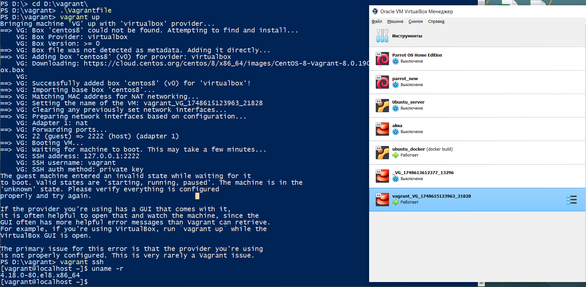

## Предисловие 
Vagrant установлен с yandexcloud, работа проводилась на win10 через PowerShell, образ centos8 взят с cloud.centos.org. При выполнении домашено задания не хотелось использовать vpn.


### Ссылка на [Vagrantfile](files/Vagrantfile)
```
D:\vagrant> vagrant up
```
## Подтверждение поднятия ВМ

## Подключаемся к ВМ
```
PS D:\vagrant> vagrant ssh
```
## Смотрим текущую версию ядра
```
[vagrant@localhost ~]$ uname -r
4.18.0-80.el8.x86_64
```
## Подключаем репозиторий, откуда возьмём необходимую версию ядра:
```
sudo yum install -y https://www.elrepo.org/elrepo-release-8.el8.elrepo.noarch.rpm 
```
## Установим последнее ядро из репозитория elrepo-kernel:
```
sudo yum --enablerepo elrepo-kernel install kernel-ml -y
```
## Обновить конфигурацию загрузчика:
```
sudo grub2-mkconfig -o /boot/grub2/grub.cfg
```
## Выбрать загрузку нового ядра по-умолчанию:
```
sudo grub2-set-default 0
```
## После перезагрузки проверяем версию ядра:
```
[vagrant@localhost ~]$ uname -r
6.14.9-1.el8.elrepo.x86_64
```
