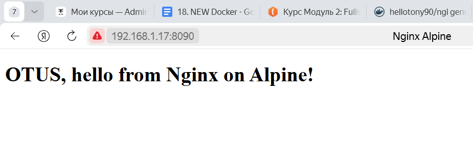

# Создать свой кастомный образ nginx на базе alpine. После запуска nginx должен отдавать кастомную страницу.
### Создадим каталог для необходимых файлов
```
root@helloubuntu:~# mkdir /usr/hello/ && cd /usr/hello/
```
### Создаем свой index.html
```
root@helloubuntu:/usr/hello# nano index.html
<!DOCTYPE html>
<html lang="en">
<head>
    <meta charset="UTF-8">
    <meta name="viewport" content="width=device-width, initial-scale=1.0">
    <title>Nginx Alpine</title>
</head>
<body>
    <h1>OTUS, hello from Nginx on Alpine!</h1>
</body>
</html>
```
### Создаем Dockerfile:
### 1. Используем базовый образ Alpine с Nginx
### 2. Копируем свой файл index.html в директорию, где Nginx ищет файлы
### 3. Cообщаем Docker Daemon, какие порты будут обрабатываться контейнером
```
root@helloubuntu:/usr/hello# nano Dockerfile
FROM alpine:latest
RUN apk update && apk add nginx
COPY index.html /usr/share/nginx/html/index.html
```
### Собираем образ:
Из директории проекта и выполняем следующую команду для сборки Docker-образа:
```
docker build -t ngi .
```
### Запускаем контейнер, переопределяем порты:
```
docker run -d -p 8090:80 ngi:latest
```
### Проверяем работу:

### Пушим собранный образ на dockerhub
```
docker login
docker tag ngi hellotony90/ngi:latest
docker push hellotony90/ngi:latest
```
### Ссылка на докерhub
### [hellotony90/ngi](https://hub.docker.com/repository/docker/hellotony90/ngi)

# Ответы на вопросы
## Определите разницу между контейнером и образом
### Kонтейнер и образ это просто разные сущности, образ это исходник, из него запускается контейнер.Основное различие между образом и контейнером — в доступном для записи верхнем слое.
## Можно ли в контейнере собрать ядро?
### Собрать ядро можно доставив все окружение, но докер все равно использует хостовое ядро
