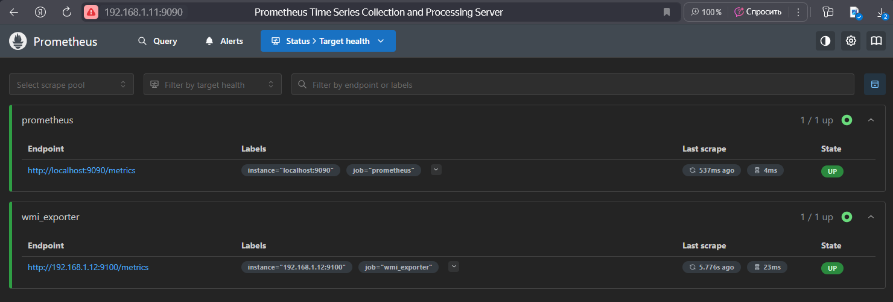
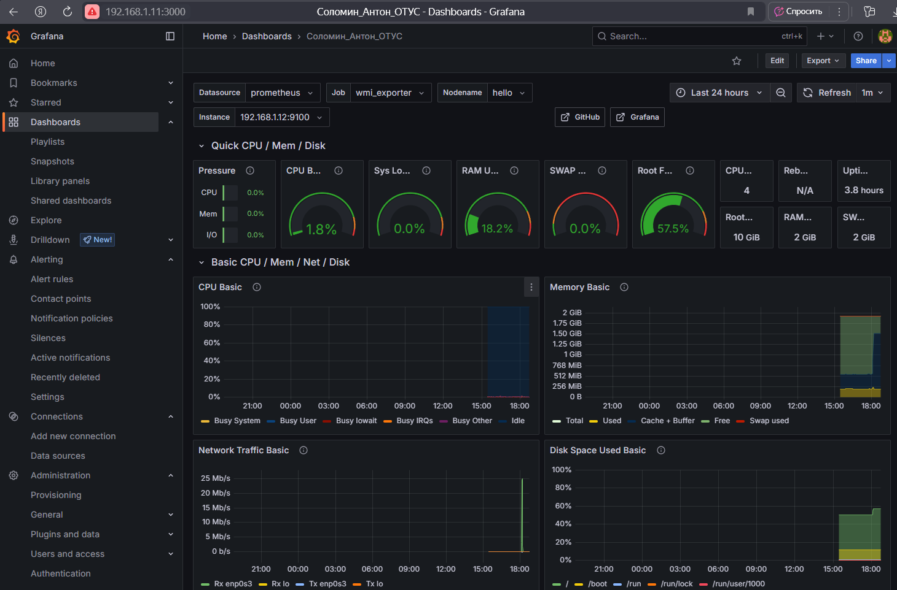
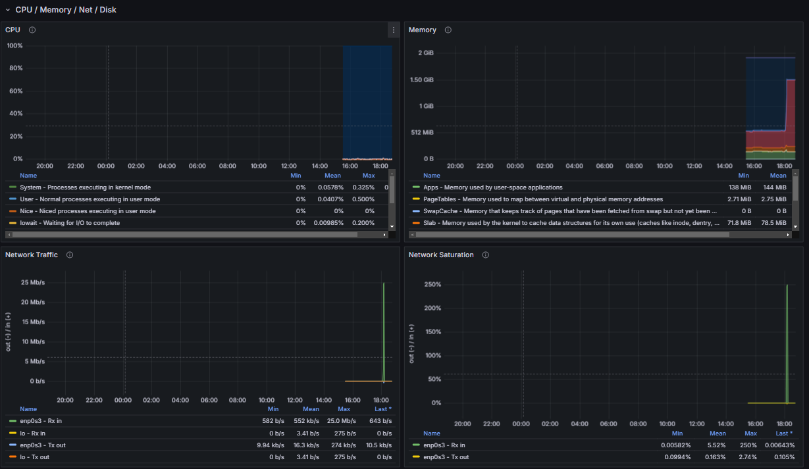
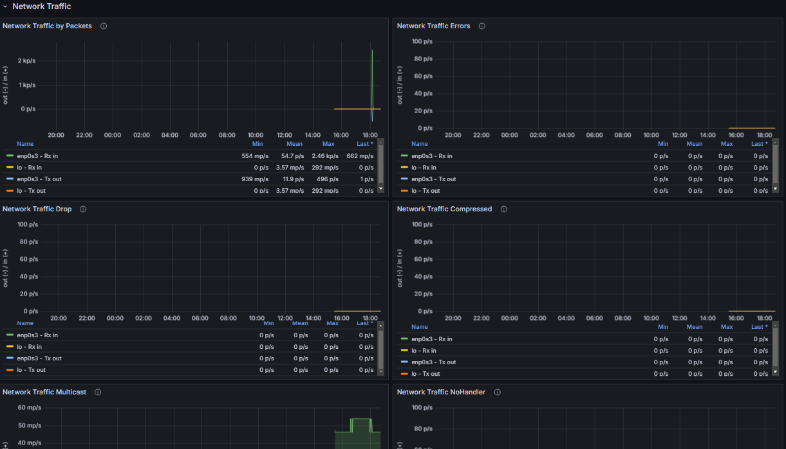

# По заданию необходимо настроить мониторинг и построить дашборд с 4 графиками.
## Выбрал prometheus+grafana потому, что заббикса в жизни хватает ☺ 

### Первый скриншот добавленный node_exporter

### Скриншоты со второго по четвертый переданные метрики 

### CPU

### Network


# Что б не было совсем пусто вставил настройку. 
## Cкачиваем Prometheus
```
hello@helloubuntu:~$ sudo -i
root@helloubuntu:~# cd /home/hello/
root@helloubuntu:/home/hello# wget https://github.com/prometheus/prometheus/releases/download/v3.4.0/prometheus-3.4.0.linux-amd64.tar.gz
```
## Создаем пользователя и нужные каталоги, настраиваем для них владельцев
```
root@helloubuntu:~#  useradd --no-create-home --shell /bin/false prometheus
root@helloubuntu:~#  mkdir /etc/prometheus
root@helloubuntu:~#  mkdir /var/lib/prometheus
root@helloubuntu:~#  chown prometheus:prometheus /etc/prometheus
root@helloubuntu:~#  chown prometheus:prometheus /var/lib/prometheus
```
## Распаковываем архив, для удобства переименовываем директорию и копируем бинарники в /usr/local/bin
```
root@helloubuntu:~# tar -xvzf prometheus-3.4.0.linux-amd64.tar.gz
root@helloubuntu:~# mv prometheus-3.4.0.linux-amd64 prometheuspackage
root@helloubuntu:~# cp prometheuspackage/prometheus /usr/local/bin/
root@helloubuntu:~# cp prometheuspackage/promtool /usr/local/bin/
```
## Меняем владельцев у бинарников
```
root@helloubuntu:~# chown prometheus:prometheus /usr/local/bin/prometheus
root@helloubuntu:~# chown prometheus:prometheus /usr/local/bin/promtool
```
## По аналогии копируем библиотеки
```
root@helloubuntu:~# cp -r prometheuspackage/consoles /etc/prometheus
root@helloubuntu:~# cp -r prometheuspackage/console_libraries /etc/prometheus
root@helloubuntu:~# chown -R prometheus:prometheus /etc/prometheus/consoles
root@helloubuntu:~# chown -R prometheus:prometheus /etc/prometheus/console_libraries
```
## Создаем файл конфигурации
```
root@helloubuntu:~#nano /etc/prometheus/prometheus.yml
global:
 scrape_interval: 10s
scrape_configs:
 - job_name: 'prometheus_master'
 scrape_interval: 5s
 static_configs:
  - job_name: 'prometheus'
    scrape_interval: 5s.
    static_configs:
      - targets: ['localhost:9090']
  - job_name: 'wmi_exporter'
    static_configs:
      - targets: ['192.168.1.12:9100']
```
## Настраиваем сервис
```
root@helloubuntu:~#nano /etc/systemd/system/prometheus.service
[Unit]
Description=Prometheus
Wants=network-online.target
After=network-online.target
[Service]
User=prometheus
Group=prometheus
Type=simple
ExecStart=/usr/local/bin/prometheus \
--config.file /etc/prometheus/prometheus.yml \
--storage.tsdb.path /var/lib/prometheus/ \
--web.console.templates=/etc/prometheus/consoles \
--web.console.libraries=/etc/prometheus/console_libraries
[Install]
WantedBy=multi-user.target
```
```
root@helloubuntu:~# systemctl daemon-reload
root@helloubuntu:~# systemctl start prometheus
root@helloubuntu:~# systemctl status prometheus
```
## Установка grafana
```
root@helloubuntu:~#wget https://mirrors.huaweicloud.com/grafana/12.0.0/grafana-enterprise_12.0.0_amd64.deb
root@helloubuntu:~# systemctl daemon-reload
root@helloubuntu:~# systemctl start grafana-server
```
## Скачиваем и распаковываем Node Exporter
```
root@helloubuntu:~# wget https://github.com/prometheus/node_exporter/releases/download/v1.9.1/node_exporter-1.9.1.linux-amd64.tar.gz
root@helloubuntu:~# tar xzfv node_exporter-1.5.0.linux-amd64.tar.gz
```
## Создаем пользователя, перемещаем бинарник в /usr/local/bin
```
root@helloubuntu:~# useradd -rs /bin/false nodeusr
root@helloubuntu:~# mv node_exporter-1.5.0.linux-amd64/node_exporter /usr/local/bin/
```
## Создаем сервис
```
root@helloubuntu:~# nano /etc/systemd/system/node_exporter.service
[Unit]
Description=Node Exporter
After=network.target
[Service]
User=nodeusr
Group=nodeusr
Type=simple
ExecStart=/usr/local/bin/node_exporter
[Install]
WantedBy=multi-user.target
```
## Запускаем сервис
```
root@helloubuntu:~# systemctl daemon-reload
root@helloubuntu:~# systemctl start node_exporter
root@helloubuntu:~# systemctl enable node_exporter
```
