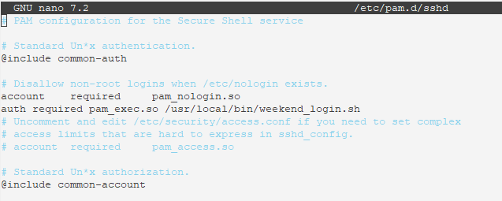
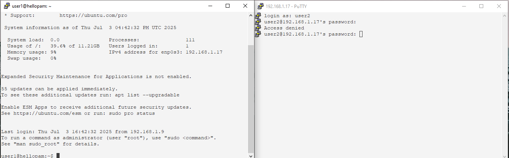

# PAM
## Задание
Запретить всем пользователям, кроме группы admin логин в выходные (суббота и воскресенье), без учета праздников
## Выполнение
### Создаем файл
```
root@hellopam:~# nano /usr/local/bin/weekend_login.sh
```
### Пишем скрипт для проверки дня недели
```
#!/bin/bash
#Определяем текущий день недели в числовом формате
DAY=$(date +%u)
 #Проверяем день недели на соответсвие заданию, если сегодня суббота или воскресенье
 if [ "$DAY" -eq 6 ] || [ "$DAY" -eq 7 ]; then
        #Если пользователь входит в группу admin, то он может подключиться
           if id -nG "$PAM_USER" | grep -qw "admin"; then
        exit 0  # Разрешаем 
    else
        exit 1  # Запрещаем
    fi
fi
```
### Делаем скрипт исполняемым
```
chmod +x /usr/local/bin/weekend_login.sh
```
## Настраиваем PAM-модуль
### Редактируем файл PAM для доступа по SSH
```
root@hellopam:~# nano /etc/pam.d/sshd
```
### Добавляем строчку для использования нашего скрипта
```
auth required pam_exec.so /usr/local/bin/weekend_login.sh
```

## Проверяем работу
### Создаем пользователей и устанавливаем пароль
```
root@hellopam:~# useradd -m -s /bin/bash user1
root@hellopam:~# passwd user1
root@hellopam:~# useradd -m -s /bin/bash user2
root@hellopam:~# passwd user2
```
### Создаем группу admin, пользователя user1 добавляем в эту группу
```
root@hellopam:~# groupadd admin
root@hellopam:~# usermod -a -G admin user1
```
### Установка и проверка времени(Из вывода видим, что время синхронизируется)
```
root@hellopam:~# date --set="Jun 29 12:12:12 2025"
Sun Jun 29 12:12:12 PM UTC 2025
root@hellopam:~# date
Thu Jul  3 04:45:52 PM UTC 2025
root@hellopam:~# timedatectl status
               Local time: Thu 2025-07-03 16:48:14 UTC
           Universal time: Thu 2025-07-03 16:48:14 UTC
                 RTC time: Thu 2025-07-03 16:48:13
                Time zone: Etc/UTC (UTC, +0000)
System clock synchronized: yes
              NTP service: active
          RTC in local TZ: no
```
### Отключаем синронизацию и устанавливаем дату на выходной день
```
root@hellopam:~# timedatectl set-ntp false
root@hellopam:~# timedatectl status
               Local time: Thu 2025-07-03 16:49:34 UTC
           Universal time: Thu 2025-07-03 16:49:34 UTC
                 RTC time: Thu 2025-07-03 16:49:33
                Time zone: Etc/UTC (UTC, +0000)
System clock synchronized: yes
              NTP service: inactive
          RTC in local TZ: no
root@hellopam:~# date --set="Jun 29 12:12:12 2025"
Sun Jun 29 12:12:12 PM UTC 2025
root@hellopam:~# date
Sun Jun 29 12:12:14 PM UTC 2025
```
### Выполняем подключение используя пользователей user1 и user2

