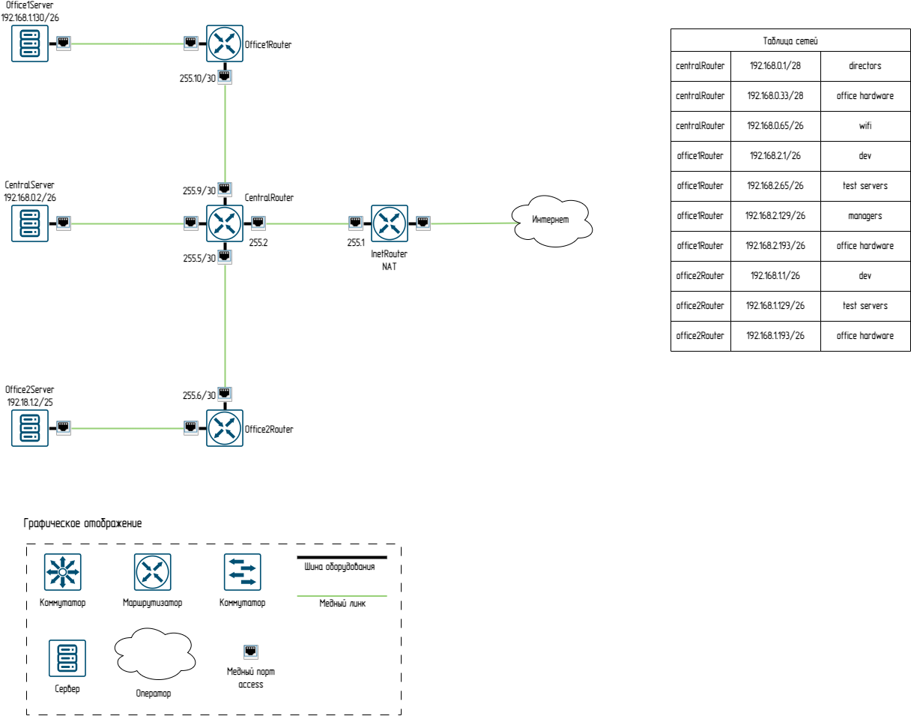
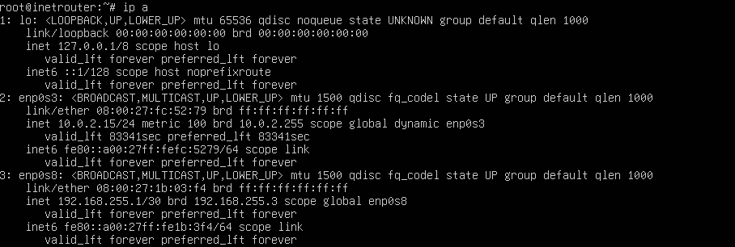
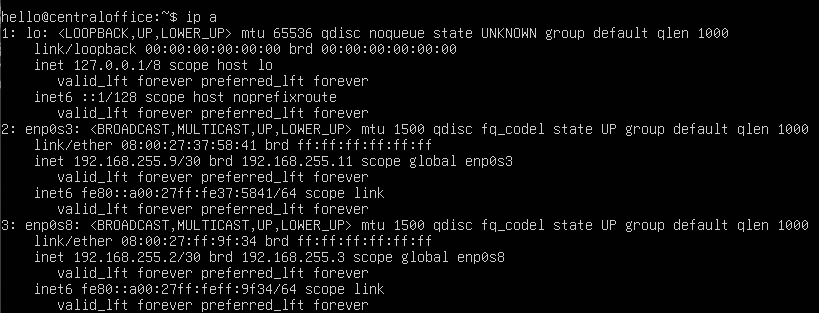
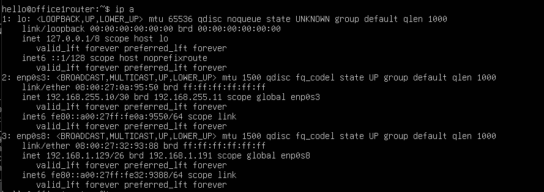
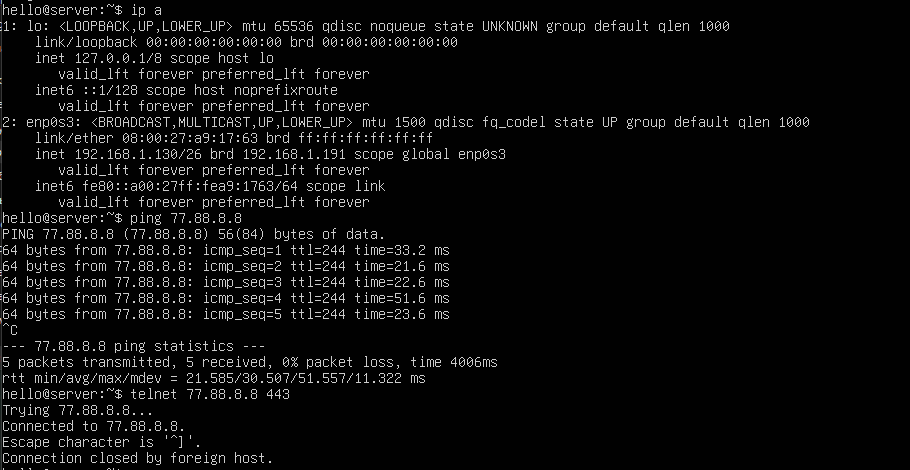

# Архитектура сетей
## Теоретическая часть

### Посчитаем те сети которые даны:
```
root@hellodocker:~# ipcalc 192.168.0.1/28
Address:   192.168.0.1          11000000.10101000.00000000.0000 0001
Netmask:   255.255.255.240 = 28 11111111.11111111.11111111.1111 0000
Wildcard:  0.0.0.15             00000000.00000000.00000000.0000 1111
=>
Network:   192.168.0.0/28       11000000.10101000.00000000.0000 0000
HostMin:   192.168.0.1          11000000.10101000.00000000.0000 0001
HostMax:   192.168.0.14         11000000.10101000.00000000.0000 1110
Broadcast: 192.168.0.15         11000000.10101000.00000000.0000 1111
Hosts/Net: 14                    Class C, Private Internet

root@hellodocker:~# ipcalc 192.168.0.33/28
Address:   192.168.0.33         11000000.10101000.00000000.0010 0001
Netmask:   255.255.255.240 = 28 11111111.11111111.11111111.1111 0000
Wildcard:  0.0.0.15             00000000.00000000.00000000.0000 1111
=>
Network:   192.168.0.32/28      11000000.10101000.00000000.0010 0000
HostMin:   192.168.0.33         11000000.10101000.00000000.0010 0001
HostMax:   192.168.0.46         11000000.10101000.00000000.0010 1110
Broadcast: 192.168.0.47         11000000.10101000.00000000.0010 1111
Hosts/Net: 14                    Class C, Private Internet

root@hellodocker:~# ipcalc 192.168.0.65/26
Address:   192.168.0.65         11000000.10101000.00000000.01 000001
Netmask:   255.255.255.192 = 26 11111111.11111111.11111111.11 000000
Wildcard:  0.0.0.63             00000000.00000000.00000000.00 111111
=>
Network:   192.168.0.64/26      11000000.10101000.00000000.01 000000
HostMin:   192.168.0.65         11000000.10101000.00000000.01 000001
HostMax:   192.168.0.126        11000000.10101000.00000000.01 111110
Broadcast: 192.168.0.127        11000000.10101000.00000000.01 111111
Hosts/Net: 62                    Class C, Private Internet

root@hellodocker:~# ipcalc 192.168.2.1/28
Address:   192.168.2.1          11000000.10101000.00000010.0000 0001
Netmask:   255.255.255.240 = 28 11111111.11111111.11111111.1111 0000
Wildcard:  0.0.0.15             00000000.00000000.00000000.0000 1111
=>
Network:   192.168.2.0/28       11000000.10101000.00000010.0000 0000
HostMin:   192.168.2.1          11000000.10101000.00000010.0000 0001
HostMax:   192.168.2.14         11000000.10101000.00000010.0000 1110
Broadcast: 192.168.2.15         11000000.10101000.00000010.0000 1111
Hosts/Net: 14                    Class C, Private Internet

root@hellodocker:~# ipcalc 192.168.2.64/26
Address:   192.168.2.64         11000000.10101000.00000010.01 000000
Netmask:   255.255.255.192 = 26 11111111.11111111.11111111.11 000000
Wildcard:  0.0.0.63             00000000.00000000.00000000.00 111111
=>
Network:   192.168.2.64/26      11000000.10101000.00000010.01 000000
HostMin:   192.168.2.65         11000000.10101000.00000010.01 000001
HostMax:   192.168.2.126        11000000.10101000.00000010.01 111110
Broadcast: 192.168.2.127        11000000.10101000.00000010.01 111111
Hosts/Net: 62                    Class C, Private Internet

root@hellodocker:~# ipcalc 192.168.2.128/26
Address:   192.168.2.128        11000000.10101000.00000010.10 000000
Netmask:   255.255.255.192 = 26 11111111.11111111.11111111.11 000000
Wildcard:  0.0.0.63             00000000.00000000.00000000.00 111111
=>
Network:   192.168.2.128/26     11000000.10101000.00000010.10 000000
HostMin:   192.168.2.129        11000000.10101000.00000010.10 000001
HostMax:   192.168.2.190        11000000.10101000.00000010.10 111110
Broadcast: 192.168.2.191        11000000.10101000.00000010.10 111111
Hosts/Net: 62                    Class C, Private Internet

root@hellodocker:~# ipcalc 192.168.2.192/26

Address:   192.168.2.192        11000000.10101000.00000010.11 000000
Netmask:   255.255.255.192 = 26 11111111.11111111.11111111.11 000000
Wildcard:  0.0.0.63             00000000.00000000.00000000.00 111111
=>
Network:   192.168.2.192/26     11000000.10101000.00000010.11 000000
HostMin:   192.168.2.193        11000000.10101000.00000010.11 000001
HostMax:   192.168.2.254        11000000.10101000.00000010.11 111110
Broadcast: 192.168.2.255        11000000.10101000.00000010.11 111111
Hosts/Net: 62                    Class C, Private Internet

root@hellodocker:~# ipcalc 192.168.1.0/25

Address:   192.168.1.0          11000000.10101000.00000001.0 0000000
Netmask:   255.255.255.128 = 25 11111111.11111111.11111111.1 0000000
Wildcard:  0.0.0.127            00000000.00000000.00000000.0 1111111
=>
Network:   192.168.1.0/25       11000000.10101000.00000001.0 0000000
HostMin:   192.168.1.1          11000000.10101000.00000001.0 0000001
HostMax:   192.168.1.126        11000000.10101000.00000001.0 1111110
Broadcast: 192.168.1.127        11000000.10101000.00000001.0 1111111
Hosts/Net: 126                   Class C, Private Internet

root@hellodocker:~# ipcalc 192.168.1.128/26
Address:   192.168.1.128        11000000.10101000.00000001.10 000000
Netmask:   255.255.255.192 = 26 11111111.11111111.11111111.11 000000
Wildcard:  0.0.0.63             00000000.00000000.00000000.00 111111
=>
Network:   192.168.1.128/26     11000000.10101000.00000001.10 000000
HostMin:   192.168.1.129        11000000.10101000.00000001.10 000001
HostMax:   192.168.1.190        11000000.10101000.00000001.10 111110
Broadcast: 192.168.1.191        11000000.10101000.00000001.10 111111
Hosts/Net: 62                    Class C, Private Internet

root@hellodocker:~# ipcalc 192.168.1.192/26
Address:   192.168.1.192        11000000.10101000.00000001.11 000000
Netmask:   255.255.255.192 = 26 11111111.11111111.11111111.11 000000
Wildcard:  0.0.0.63             00000000.00000000.00000000.00 111111
=>
Network:   192.168.1.192/26     11000000.10101000.00000001.11 000000
HostMin:   192.168.1.193        11000000.10101000.00000001.11 000001
HostMax:   192.168.1.254        11000000.10101000.00000001.11 111110
Broadcast: 192.168.1.255        11000000.10101000.00000001.11 111111
Hosts/Net: 62                    Class C, Private Internet

```
#### Ошибок при разбиении нет.
## Практическая часть
### Настройка сетевых интерфейсов
Настройка сетевых интерфейсов производится согласно заданию через службу netplan
```
root@centraloffice:~# nano /etc/netplan/50-cloud-init.yaml
network:
  ethernets:
    enp0s8:
      dhcp4: no
      addresses:
        - 192.168.255.2/30
      routes:
        - to: default
          via: 192.168.255.1
    enp0s3:
        dhcp4: no
        addresses:
          - 192.168.255.9/30
        routes:
        - to: 192.168.1.128/26
          via: 192.168.255.10
root@centraloffice:~# netplan try
```
### Настройка маршрутизации транзитных пакетов
```
root@centraloffice:~# echo "net.ipv4.conf.all.forwarding = 1" >> /etc/sysctl.conf
root@centraloffice:~# sysctl -p
net.ipv4.conf.all.forwarding = 1
```
### Настройка NAT
```
# Проверка состояние файервола
root@inetrouter:~# systemctl status ufw
● ufw.service - Uncomplicated firewall
     Loaded: loaded (/usr/lib/systemd/system/ufw.service; enabled; preset: enab>
     Active: active (exited) since Mon 2025-07-07 12:55:36 UTC; 7min ago
       Docs: man:ufw(8)
   Main PID: 518 (code=exited, status=0/SUCCESS)
        CPU: 1ms
Jul 07 12:55:36 centraloffice systemd[1]: Starting ufw.service - Uncomplicated >
Jul 07 12:55:36 centraloffice systemd[1]: Finished ufw.service - Uncomplicated >
# Нужно отключить и удалить из автозагрузки:
root@inetrouter:~# systemctl stop ufw
root@inetrouter:~# systemctl disable ufw
# Создаём файл
root@inetrouter:~# nano /etc/iptables_rules.ipv4:
*nat
:PREROUTING ACCEPT [0:0]
:INPUT ACCEPT [0:0]
:OUTPUT ACCEPT [0:0]
:POSTROUTING ACCEPT [0:0]
-A POSTROUTING ! -d 192.168.0.0/16 -o enp0s3 -j MASQUERADE
COMMIT
# Cоздаём файл, в который добавим скрипт автоматического восстановления правил при перезапуске системы:
root@inetrouter:~# nano /etc/network/if-pre-up.d/iptables
#!/bin/sh
/sbin/iptables-restore < /etc/iptables_rules.ipv4
# Добавляем права на выполнение файла
root@inetrouter:~# chmod +x /etc/network/if-pre-up.d/iptables
# После перезагрузки сервера проверяем правила iptables
root@centraloffice:~# iptables-save
:PREROUTING ACCEPT [0:0]
:INPUT ACCEPT [0:0]
:OUTPUT ACCEPT [0:0]
:POSTROUTING ACCEPT [1:72]
-A POSTROUTING ! -d 192.168.0.0/16 -o enp0s3 -j MASQUERADE
COMMIT
```
## Проверка




