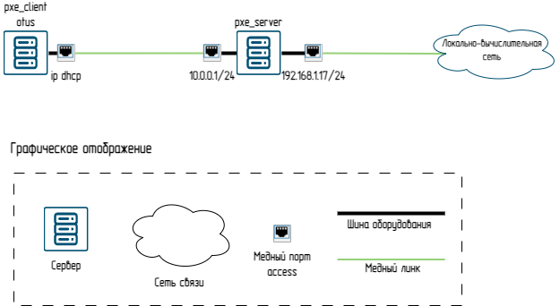
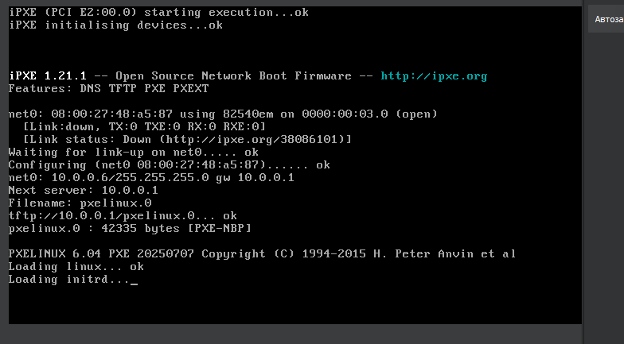
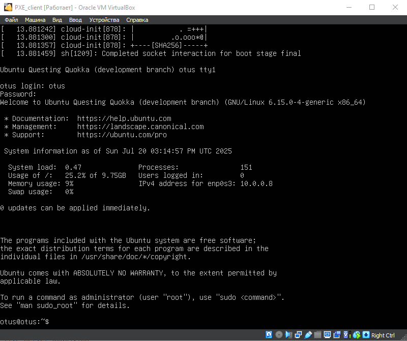
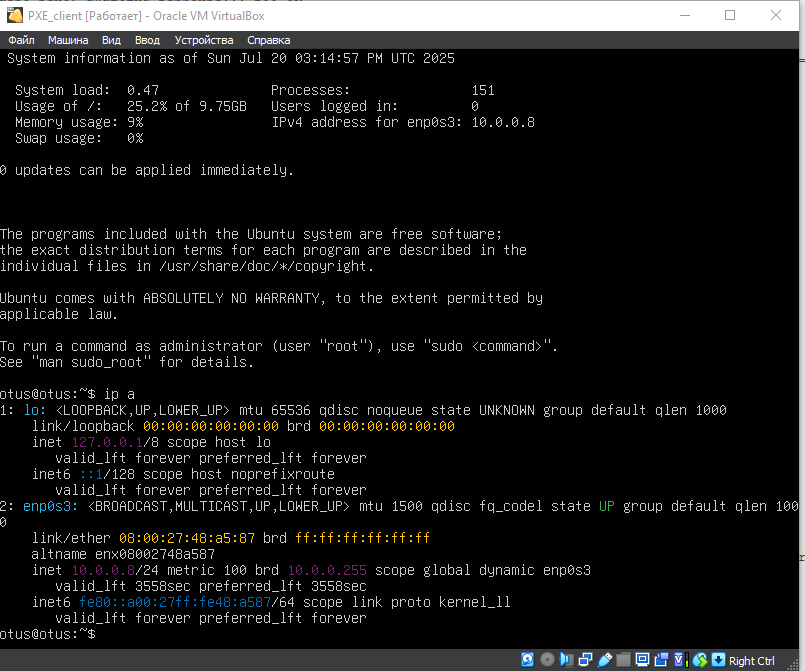

# Схема сети

# Настройка DHCP,TFTP
## 0. Тыкаю настройки в netplan согласно нашей схеме
```
root@pxeserver:/# nano /etc/netplan/50-cloud-init.yaml
network:
  version: 2
  ethernets:
    enp0s3:
      dhcp4: true
    enp0s8:
      dhcp4: no
      addresses: [10.0.0.1/24]
root@pxeserver:/# netplan try
```
## 1. Обновляем кэш и устанавливаем утилиту dnsmasq(DNS-, DHCP- и TFTP-сервер)
```
root@pxeserver:/# apt update
root@pxeserver:/# apt install dnsmasq
```
## 2. Cоздаём файл /etc/dnsmasq.d/pxe.conf и добавляем в него следующее содержимое
```
root@pxeserver:/# nano /etc/dnsmasq.d/pxe.conf
interface=enp0s8
bind-interfaces
dhcp-range=enp0s8,10.0.0.5,10.0.0.10
dhcp-boot=pxelinux.0
dhcp-match=set:efi-x86_64,option:client-arch,7
dhcp-boot=tag:efi-x86_64,bootx64.efi
enable-tftp
tftp-root=/srv/tftp/amd64
```
## 3. Cоздаём каталоги для файлов TFTP-сервера, скачиваем файлы для сетевой установки Ubuntu и распаковываем их в каталог /srv/tftp
```
root@pxeserver:/# mkdir -p /srv/tftp
root@pxeserver:/# wget https://cdimage.ubuntu.com/ubuntu-server/daily-live/current/questing-netboot-amd64.tar.gz
tar -xzvf questing-netboot-amd64.tar.gz -C /srv/tftp
```
## 4. Перезапускаем службу dnsmasq
```
root@pxeserver:/# systemctl restart dnsmasq
```
## 5. Настройка Web-сервера создаём каталог /srv/images
```
root@pxeserver:/# apt install apache2
root@pxeserver:/# mkdir /srv/images && cd /srv/images
root@pxeserver:/# wget https://cdimage.ubuntu.com/ubuntu-server/daily-live/current/questing-live-server-amd64.iso

```
## 6. создаём файл /etc/apache2/sites-available/ks-server.conf и добавлем в него следующее содержимое
```
root@pxeserver:/# nano /etc/apache2/sites-available/ks-server.conf
<VirtualHost 10.0.0.1:80>
DocumentRoot /
<Directory /srv/ks>
Options Indexes MultiViews
AllowOverride All
Require all granted
</Directory>
<Directory /srv/images>
Options Indexes MultiViews
AllowOverride All
Require all granted
</Directory>
</VirtualHost>

```
```
a2ensite ks-server.conf
```

## 7. Вносим изменения в файл /srv/tftp/amd64/pxelinux.cfg/default
```
root@pxeserver:/# nano /srv/tftp/amd64/pxelinux.cfg/default
DEFAULT install
LABEL install
  KERNEL linux
  INITRD initrd
  APPEND root=/dev/ram0 ramdisk_size=3000000 ip=dhcp iso-url=http://10.0.0.1/srv/images/questing-live-server-amd64.iso autoinstall ds=nocloud-net;s=http://10.0.0.1/srv/ks/

```
## 8. Перезагружаем web-сервер apache
```
systemctl restart apache2
```
## 9. Автоматическая установка Ubuntu 
```
nano  /srv/ks/user-data
#cloud-config
autoinstall:
apt:
disable_components: []
geoip: true
preserve_sources_list: false
primary:
- arches:
- amd64
- i386
uri: http://us.archive.ubuntu.com/ubuntu
- arches:
- default
uri: http://ports.ubuntu.com/ubuntu-ports
drivers:
install: false
identity:
hostname: linux
password: $6$sJgo6Hg5zXBwkkI8$btrEoWAb5FxKhajagWR49XM4EAOfO/
Dr5bMrLOkGe3KkMYdsh7T3MU5mYwY2TIMJpVKckAwnZFs2ltUJ1abOZ.
realname: otus
username: otus
kernel:
package: linux-generic
keyboard:
layout: us
toggle: null
variant: ''
locale: en_US.UTF-8
network:
ethernets:
enp0s3:
dhcp4: true
enp0s8:
dhcp4: true
version: 2
ssh:
allow-pw: true
authorized-keys: []
install-server: true
updates: security
version: 1
```
## 10. 6) перезапускаем службы dnsmasq и apache2
```
systemctl restart dnsmasq
systemctl restart apache2
```
# Проверка 
## Включение ВМ, начало установки 

## Установленная ОС логин пароль otus 123

## Проверка интерфейсов

## Проверка dnsmasq
```
root@pxeserver:/# grep dnsmasq /var/log/syslog
2025-07-20T12:09:52.827355+00:00 pxeserver dnsmasq-tftp[3395]: sent /srv/tftp/amd64/pxelinux.cfg/default to 10.0.0.6
2025-07-20T12:09:57.402538+00:00 pxeserver dnsmasq-tftp[3395]: sent /srv/tftp/amd64/linux to 10.0.0.6
2025-07-20T12:10:03.789987+00:00 pxeserver dnsmasq-tftp[3395]: sent /srv/tftp/amd64/initrd to 10.0.0.6
2025-07-20T12:10:24.006522+00:00 pxeserver dnsmasq-dhcp[3395]: DHCPDISCOVER(enp0s8) 08:00:27:48:a5:87
2025-07-20T12:14:49.580325+00:00 pxeserver dnsmasq-dhcp[3395]: DHCPOFFER(enp0s8) 10.0.0.8 08:00:27:48:a5:87
2025-07-20T12:14:49.580477+00:00 pxeserver dnsmasq-dhcp[3395]: DHCPREQUEST(enp0s8) 10.0.0.8 08:00:27:48:a5:87
2025-07-20T12:14:49.580505+00:00 pxeserver dnsmasq-dhcp[3395]: DHCPACK(enp0s8) 10.0.0.8 08:00:27:48:a5:87 otus
```
