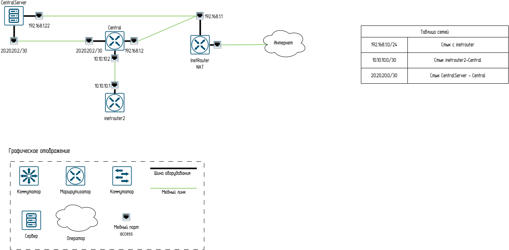

# Схемка сети

## Работа с Knockd
### Установка и настройка knockd
```
root@central:~# apt install knockd
root@central:~# nano /etc/knockd.conf
[options]
        UseSyslog

[openSSH]
        sequence    = 7000,8000,9000
        seq_timeout = 10
        command     = /sbin/iptables -I INPUT -p tcp --dport 22 -j ACCEPT
        tcpflags    = syn

[closeSSH]
        sequence    = 9000,8000,7000
        seq_timeout = 5
        command     = /sbin/iptables -D INPUT -p tcp --dport 22 -j ACCEPT
        tcpflags    = syn
```
### Проверяю установлен ли iptables добавляю правила
```
root@central:~# iptables --version
iptables v1.8.10 (nf_tables)

root@central:~# iptables -A INPUT -i enp0s8 -m state --state ESTABLISHED,RELATED -j ACCEPT
root@central:~# iptables -A INPUT -i enp0s8 -j DROP
```
### Редактирую knockd запускаю службу
```
root@central:~#nano /etc/default/knockd

# control if we start knockd at init or not
# 1 = start
# anything else = don't start
# PLEASE EDIT /etc/knockd.conf BEFORE ENABLING
START_KNOCKD=0

# command line options
KNOCKD_OPTS="-i enp0s8"

root@central:~# systemctl start knockd.service
root@central:~# systemctl status knockd.service
```
### Тестирование ssh через knockd
```
root@inetrouter2:~# knock 10.10.10.1 7000 8000 9000
# Смотрю логи
root@central:~#  systemctl status knockd.service
● knockd.service - Port-Knock Daemon
     Loaded: loaded (/usr/lib/systemd/system/knockd.service; enabled; preset: enabled)
     Active: active (running) since Sat 2025-07-19 11:56:35 UTC; 2h 4min ago
       Docs: man:knockd(1)
    Process: 1195 ExecReload=/bin/kill -HUP $MAINPID (code=exited, status=0/SUCCESS)
   Main PID: 1100 (knockd)
      Tasks: 1 (limit: 2268)
     Memory: 820.0K (peak: 1.8M)
        CPU: 37ms
     CGroup: /system.slice/knockd.service
             └─1100 /usr/sbin/knockd -i enp0s8

Jul 19 12:14:53 central systemd[1]: Reloading knockd.service - Port-Knock Daemon...
Jul 19 12:14:53 central knockd[1100]: re-reading config file: /etc/knockd.conf
Jul 19 12:14:53 central knockd[1100]: re-opening log file:
Jul 19 12:14:53 central systemd[1]: Reloaded knockd.service - Port-Knock Daemon.
Jul 19 12:14:53 central knockd[1100]: warning: cannot open logfile: No such file or directory
Jul 19 12:14:58 central knockd[1100]: 10.10.10.2: openSSH: Stage 1
Jul 19 12:14:58 central knockd[1100]: 10.10.10.2: openSSH: Stage 2
Jul 19 12:14:58 central knockd[1100]: 10.10.10.2: openSSH: Stage 3
Jul 19 12:14:58 central knockd[1100]: 10.10.10.2: openSSH: OPEN SESAME
Jul 19 12:14:58 central knockd[1199]: openSSH: running command: /sbin/iptables -I INPUT -p tcp --dport 22 -j ACCEPT
# Телнечу SSH :)
root@inetrouter2:~# telnet 10.10.10.1 22
Trying 10.10.10.1...
Connected to 10.10.10.1.
Escape character is '^]'.
SSH-2.0-OpenSSH_9.6p1 Ubuntu-3ubuntu13.12
```
## Проброс портов
### Настройка NAT
```
# Настроим так что бы запросы на порт tcp/8080 перенаправлялись на 80 порт нужного сервера
root@inetrouter2:~# iptables -t nat -A PREROUTING -i enp0s10 -p tcp --dport 8080 -j DNAT --to-destination 20.20.20.2:80
root@inetrouter2:~# iptables -t nat -A PREROUTING -i enp0s3 -p tcp --dport 8080 -j DNAT --to-destination 20.20.20.2:80
#Так как файервол у меня открытый больше ничего не требуется в случае чего необходмо добавить правло в цепочку FORWARD
```
### На сервер устанавлтваю nginx и проверяю что слушает 80 порт, дефолтный конфиг не меняю
```
root@centralserver:~# apt install nginx
root@centralserver:~# ss -tunlp | grep 80
tcp   LISTEN 0      511                0.0.0.0:80        0.0.0.0:*    users:(("nginx",pid=1518,fd=8),("nginx",pid=782,fd=8))
```
### Добавляю маршруты на сервер проверяю с 192.168.1.9 поэтому приписываю метрику 1 данному маршруту и отправляю через другой интерфейс
``` 
root@centralserver:~# ip route
default via 192.168.1.1 dev enp0s3 proto dhcp src 192.168.1.22 metric 100
20.20.20.0/30 dev enp0s8 proto kernel scope link src 20.20.20.2
192.168.1.0/24 dev enp0s3 proto kernel scope link src 192.168.1.22 metric 100
192.168.1.9 via 20.20.20.1 dev enp0s8 metric 1
```
### Проверяю со своей машины(можно было забрать curl'ом с другой машины, но решил вставить картнку)

```
root@centralserver:~# ping 77.88.8.8
PING 77.88.8.8 (77.88.8.8) 56(84) bytes of data.
64 bytes from 77.88.8.8: icmp_seq=1 ttl=56 time=22.3 ms
64 bytes from 77.88.8.8: icmp_seq=1 ttl=55 time=22.7 ms
64 bytes from 77.88.8.8: icmp_seq=2 ttl=56 time=72.2 ms
64 bytes from 77.88.8.8: icmp_seq=2 ttl=55 time=72.7 ms 
64 bytes from 77.88.8.8: icmp_seq=3 ttl=56 time=41.2 ms
```
