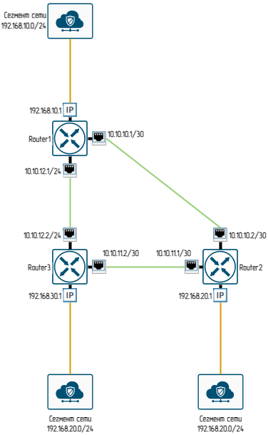

# Маршрутизация
## Схема нашей сети

## Выполнение задания
1. Поднимаем ВМ с необходимым количеством интерфейсов согласно схеме сети.
2. Устанавливаем необходимые пакеты(на примере одного из роутеров)
```
root@centraloffice:~# apt update
root@centraloffice:~# apt install vim traceroute tcpdump net-tools
root@centraloffice:~# apt install frr frr-pythontools
# Открываем в редакторе файл /etc/frr/daemons и меняем параметры ospf и bgp на yes
root@centraloffice:~# nano /etc/frr/daemons
#
bgpd=yes
ospfd=yes
#
3. Создаём файл /etc/frr/frr.conf 
```
root@centraloffice:~# nano /etc/frr/frr.conf
# Вносим в него параметры интерфейсов(т.к. я сетевой инженер по профессии я внес только часть остально затолкал через vtysh)
```
4. Устанавливаем права
```
root@centraloffice:~# chown frr:frr /etc/frr/frr.conf 
root@centraloffice:~# chmod 640 /etc/frr/frr.conf 
```
5. Перезапускаем службу и добавляем в атозагрузку
```
root@centraloffice:~# systemct restart frr 
root@centraloffice:~# systemctl enable frr
```
6. Считаем что установили все пакеты на наши роутеры, приведу листиг роутера настроенного через vtysh. Добавил passive-ospf default, что бы hello не летали со всех интерфейсов(В данной лабе не критично)
```
router-3# sh run
Building configuration...

Current configuration:
!
frr version 8.4.4
frr defaults traditional
hostname server
log syslog informational
no ipv6 forwarding
hostname router-3
service integrated-vtysh-config
!
interface enp0s3
 ip address 10.10.11.2/30
 ip ospf mtu-ignore
 no ip ospf passive
exit
!
interface enp0s8
 ip address 10.10.12.2/30
 ip ospf mtu-ignore
 no ip ospf passive
exit
!
router ospf
 ospf router-id 10.10.11.2
 passive-interface default
 network 10.10.11.0/30 area 0
 network 10.10.12.0/30 area 0
 neighbor 10.10.11.1
 neighbor 10.10.12.1
exit
!
end

router-3# sh ip os neighbor

Neighbor ID     Pri State           Up Time         Dead Time Address         Interface                        RXmtL RqstL DBsmL
10.10.10.2        1 Full/Backup     30m39s            30.544s 10.10.11.1      enp0s3:10.10.11.2                    0     0     0
10.10.12.1        1 Full/Backup     19m37s            35.348s 10.10.12.1      enp0s8:10.10.12.2                    0     0     0

router-3# show ip route
Codes: K - kernel route, C - connected, S - static, R - RIP,
       O - OSPF, I - IS-IS, B - BGP, E - EIGRP, N - NHRP,
       T - Table, v - VNC, V - VNC-Direct, A - Babel, F - PBR,
       f - OpenFabric,
       > - selected route, * - FIB route, q - queued, r - rejected, b - backup
       t - trapped, o - offload failure

K>* 0.0.0.0/0 [0/100] via 192.168.1.1, enp0s9, src 192.168.1.22, 00:43:03
K>* 8.8.8.8/32 [0/100] via 192.168.1.1, enp0s9, src 192.168.1.22, 00:43:03
O>* 10.10.10.0/30 [110/200] via 10.10.11.1, enp0s3, weight 1, 00:01:57
  *                         via 10.10.12.1, enp0s8, weight 1, 00:01:57
O   10.10.11.0/30 [110/100] is directly connected, enp0s3, weight 1, 00:01:57
C>* 10.10.11.0/30 is directly connected, enp0s3, 00:43:26
O   10.10.12.0/30 [110/100] is directly connected, enp0s8, weight 1, 00:31:49
C>* 10.10.12.0/30 is directly connected, enp0s8, 00:43:26
K>* 77.88.8.8/32 [0/100] via 192.168.1.1, enp0s9, src 192.168.1.22, 00:43:03
C>* 192.168.1.0/24 [0/100] is directly connected, enp0s9, 00:43:03
K>* 192.168.1.1/32 [0/100] is directly connected, enp0s9, 00:43:03
O>* 192.168.10.0/24 [110/200] via 10.10.12.1, enp0s8, weight 1, 00:20:02
O>* 192.168.20.0/24 [110/200] via 10.10.11.1, enp0s3, weight 1, 00:01:57
```
Поменяем Cost на интерфейсе и посмотрим таблицу маршрутизации
```
router-3(config)# interface enp0s3
router-3(config-if)# ip ospf cost 1000
router-3(config-if)# do sh ip route
# Уменьшил вывод
O>* 192.168.20.0/24 [110/300] via 10.10.12.1, enp0s8, weight 1, 00:00:03
```
Видим что маршрутизация изменилась
```
# Добавляем маршрутизацию транзитных пакетов:
root@centraloffice:~# sysctl net.ipv4.conf.all.forwarding=1
# Выключаем блокировку ассиметричной маршрутизации
root@centraloffice:~# sysctl net.ipv4.conf.all.rp_filter=0
net.ipv4.conf.all.rp_filter = 0
```
Исправляем ситуацию с ассинхронной маршрутизацией добавляем cost на интерфейс
```
router-2(config)# interface enp0s10
router-2(config)# ip address 10.10.11.1/30
router-2(config)# ip ospf cost 10000
# Проверяем маршрутизацию
router-2# traceroute 192.168.30.1
traceroute to 192.168.30.1 (192.168.30.1), 30 hops max, 60 byte packets
 1  10.10.10.1 (10.10.10.1)  0.238 ms  0.217 ms  0.208 ms
 2  192.168.30.1 (192.168.30.1)  0.691 ms  0.658 ms  0.652 ms

router-3# traceroute 192.168.20.1
traceroute to 192.168.20.1 (192.168.20.1), 30 hops max, 60 byte packets
 1  10.10.12.1 (10.10.12.1)  0.314 ms  0.363 ms  0.351 ms
 2  192.168.20.1 (192.168.20.1)  15.176 ms  15.133 ms  15.055 ms
```

## Ради интереса поднял bgp
```
router-1(config)# do sh run bgp
Building configuration...

Current configuration:
!
frr version 8.4.4
frr defaults traditional
hostname helloubuntu
log syslog informational
hostname router-1
service integrated-vtysh-config
!
router bgp 65001
 no bgp ebgp-requires-policy
 neighbor 10.10.12.2 remote-as 65002
 !
 address-family ipv4 unicast
  redistribute connected
 exit-address-family
exit
!
end

router-3# sh run bgp
Building configuration...

Current configuration:
!
frr version 8.4.4
frr defaults traditional
hostname server
log syslog informational
hostname router-3
service integrated-vtysh-config
!
router bgp 65002
 no bgp ebgp-requires-policy
 neighbor 10.10.12.1 remote-as 65001
 !
 address-family ipv4 unicast
  redistribute connected
 exit-address-family
exit
!
end

router-3# sh ip bgp all summary

IPv4 Unicast Summary (VRF default):
BGP router identifier 192.168.30.1, local AS number 65002 vrf-id 0
BGP table version 6
RIB entries 11, using 2112 bytes of memory
Peers 1, using 724 KiB of memory

Neighbor        V         AS   MsgRcvd   MsgSent   TblVer  InQ OutQ  Up/Down State/PfxRcd   PfxSnt Desc
10.10.12.1      4      65001        16        15        0    0    0 00:07:22            4        6 N/A

```
