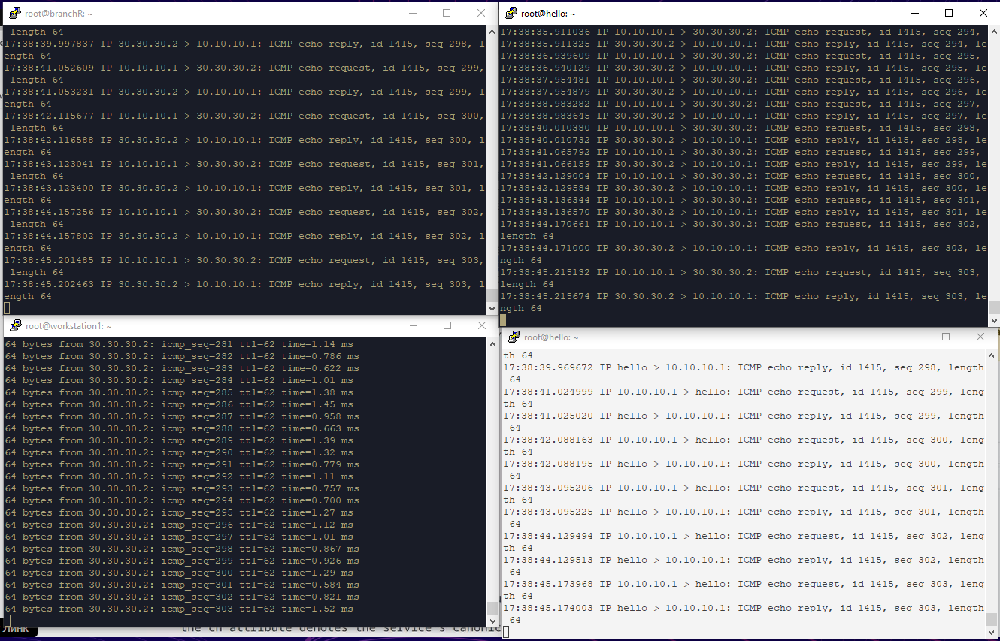

VLAN_Bond
## Схема сети
 
## Настройка наших хостов (что то настраивал через neplan, что то через nmcli)
### Настройка BranchR
```
root@branchR:~#root@branchR:~# nano /etc/netplan/50-cloud-init.yaml
network:
  version: 2
  ethernets:
    enp0s3:
      dhcp4: true
    enp0s8:
      dhcp4: no
      addresses:
       - 20.20.20.1/24
    enp0s9: {}
  vlans:
       vlan10:
         id: 10
         link: enp0s9
         dhcp4: no
         addresses:
          - 10.10.10.2/24
```
### Настройка Workstation1
```
root@workstation1:~# nano /etc/netplan/50-cloud-init.yaml
network:
  version: 2
  ethernets:
    enp0s3:
      dhcp4: true
    enp0s8: {}
  vlans:
      vlan10:
        id: 10
        link: enp0s8
        dhcp4: no
        addresses:
          - 10.10.10.1/24

```
### Настройка MainR
```
root@MainR:~#  nano /etc/netplan/50-cloud-init.yaml
network:
  version: 2
  ethernets:
    enp0s3:
      dhcp4: true
    enp0s8:
      addresses:
      - "20.20.20.2/24"
      dhcp4: false

root@MainR:~# nmcli con add type bond con-name bond0 ifname bond0 mode active-backup ip4 30.30.30.1/24
root@MainR:~# nmcli con add type bond-slave ifname enp0s9 master bond0
root@MainR:~# nmcli con add type bond-slave ifname enp0s10 master bond0
root@MainR:~# nmcli connection up bond-slave-enp0s9
root@MainR:~# nmcli connection up bond-slave-enp0s10
root@MainR:~# nmcli connection up bond0
```
### Настройка ispR
```
root@ispR:~# nmcli con add type bond-slave ifname enp0s8 master bond0
root@ispR:~# nmcli con add type bond-slave ifname enp0s9 master bond0
root@ispR:~# nmcli connection up bond-slave-enp0s8
root@ispR:~# nmcli connection up bond-slave-enp0s9
root@ispR:~# nmcli connection up bond 0
```

## P.S. Действия которые необходимы для работоспособности стенда
### Включение форвардинга
```
sysctl -w net.ipv4.ip_forward=1
root@hello:~# sysctl -p
```
### Настройка маршрутизации
```
root@workstation1:~# ip route add 20.20.20.0/24 via 10.10.10.2
root@workstation1:~# ip route add 30.30.30.0/24 via 10.10.10.2
```
### Для работы бондинга установка доппакетов
```
apt install network-manager
apt install ifenslave
```
