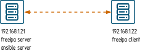
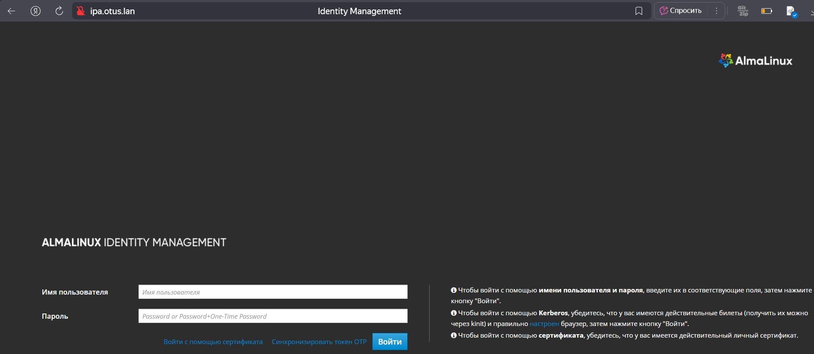
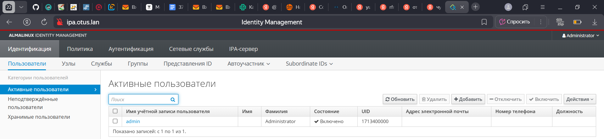
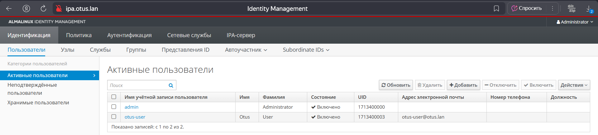

Схема лабораторной работы 

# Установка FreeIPA сервера
## Подготовка ВМ для работы
### Проверяем сетевые интефрейсы
```
[root@localhost ~]# ip a
1: lo: <LOOPBACK,UP,LOWER_UP> mtu 65536 qdisc noqueue state UNKNOWN group default qlen 1000
    link/loopback 00:00:00:00:00:00 brd 00:00:00:00:00:00
    inet 127.0.0.1/8 scope host lo
       valid_lft forever preferred_lft forever
    inet6 ::1/128 scope host
       valid_lft forever preferred_lft forever
2: enp0s3: <BROADCAST,MULTICAST,UP,LOWER_UP> mtu 1500 qdisc fq_codel state UP group default qlen 1000
    link/ether 08:00:27:62:91:8e brd ff:ff:ff:ff:ff:ff
    inet 192.168.1.21/24 brd 192.168.1.255 scope global dynamic noprefixroute enp0s3
       valid_lft 5731sec preferred_lft 5731sec
```
### Отключаем ipv6 на интерфейсе enp0s3
<details>
  <summary>Нажмите здесь, чтобы узнать зачем</summary>
  <p> При первой попытке выполнить данную лабу v6 не был выключен и случилось следующее
     
      Could not reliably determine the server's fully qualified domain name, using fe80::a00:27ff:fe62:918e%enp0s3
     
      В Apache нет глобальной директивы ServerName и при установке использовался ipv6 адрес, что поломало мне стенд. Пришлось востанавливать ВМ из снимка
  </p>
</details>

```
net.ipv6.conf.all.disable_ipv6 = 1
```
```
systemctl status chronyd.service
[root@localhost ~]# systemctl status chronyd.service
● chronyd.service - NTP client/server
     Loaded: loaded (/usr/lib/systemd/system/chronyd.service; enabled; preset: enabled)
     Active: active (running) since Sun 2025-08-03 12:50:09 MSK; 53min ago
       Docs: man:chronyd(8)
             man:chrony.conf(5)
   Main PID: 37834 (chronyd)
      Tasks: 1 (limit: 50408)
     Memory: 1016.0K
        CPU: 46ms
     CGroup: /system.slice/chronyd.service
             └─37834 /usr/sbin/chronyd -F 2
```
```
hostnamectl set-hostname ipa.otus.lan
[root@localhost ~]# hostname
ipa.otus.lan

```
### Выключим Firewall:
```
[root@ipa ~]# systemctl stop firewalld
```
### Выключим Selinux
```
[root@ipa ~]# setenforce 0
```
### Поменяем в файле /etc/selinux/config, параметр Selinux на disabled
```
[root@ipa ~]# nano /etc/selinux/config
SELINUX=disabled
```
### DNS нет пропишем в hosts запись
```
[root@ipa ~]# nano  /etc/hosts
127.0.0.1   localhost localhost.localdomain 
127.0.1.1 ipa.otus.lan ipa
192.168.57.10 ipa.otus.lan ipa
```
### Установим FreeIPA-сервер
[root@ipa ~]# yum install -y ipa-server
### Запустим скрипт установки
[root@ipa ~]#ipa-server-install
Далее, нам потребуется указать параметры нашего LDAP-сервера
Setup complete

Next steps:
        1. You must make sure these network ports are open:
                TCP Ports:
                  * 80, 443: HTTP/HTTPS
                  * 389, 636: LDAP/LDAPS
                  * 88, 464: kerberos
                  * 53: bind
                UDP Ports:
                  * 88, 464: kerberos
                  * 53: bind
                  * 123: ntp

        2. You can now obtain a kerberos ticket using the command: 'kinit admin'
           This ticket will allow you to use the IPA tools (e.g., ipa user-add)
           and the web user interface.
### Проверим, что сервер Kerberos может выдать нам билет и потом удалим его
```
[root@localhost ~]# kinit admin
[root@localhost ~]# klist
Ticket cache: KCM:0
Default principal: admin@OTUS.LAN

Valid starting       Expires              Service principal
03.08.2025 13:35:52  04.08.2025 13:21:00  krbtgt/OTUS.LAN@OTUS.LAN
[root@localhost ~]# kdestroy
[root@localhost ~]# klist
klist: Credentials cache 'KCM:0' not found
```
### Так как я управляю стендом с Win10, пропишу в hosts запись
```
c:\Windows\System32\Drivers\etc\hosts
192.168.1.21 ipa.otus.lan
```
## Проверка 
### Web-мордочка


### Наш админ


## На этом установка и настройка FreeIPA-сервера завершена.
# Ansible playbook для конфигурации клиента
## Создаем инвентори
```
root@ipa ~]# nano /root/ansible-inventory/inv.inventory
[webserver]
server1 ansible_ssh_host=192.168.1.22 ansible_ssh_user=alma
```
## Создаем провижинг
```
[root@ipa ~]#  nano provision.yml
- name: Base set up
  hosts: webserver
  #Выполнять действия от root-пользователя
  become: yes
  tasks:
  #Установка текстового редактора Vim и chrony
  - name: install softs on Alma
    yum:
      name:
        - vim
        - chrony
      state: present
      update_cache: true

  #Отключение firewalld и удаление его из автозагрузки
  - name: disable firewalld
    service:
      name: firewalld
      state: stopped
      enabled: false

  #Отключение SElinux из автозагрузки
  #Будет применено после перезагрузки
#  - name: disable SElinux
 #   selinux:
  #    state: disabled

  #Отключение SElinux до перезагрузки
  - name: disable SElinux now
    shell: setenforce 0

  #Установка временной зоны Европа/Москва
#  - name: Set up timezone
 #   timezone:
  #    name: "Europe/Moscow"

  #Запуск службы Chrony, добавление её в автозагрузку
  - name: enable chrony
    service:
      name: chronyd
      state: restarted
      enabled: true

  #Копирование файла /etc/hosts c правами root:root 0644
  - name: change /etc/hosts
    template:
      src: hosts.j2
      dest: /etc/hosts
      owner: root
      group: root
      mode: 0644

  #Установка клиента Freeipa
  - name: install module ipa-client
    yum:
      name:
        - freeipa-client
      state: present
      update_cache: true

  #Запуск скрипта добавления хоста к серверу
  - name: add host to ipa-server
    shell: echo -e "yes\nyes" | ipa-client-install --mkhomedir --domain=OTUS.LAN --server=ipa.otus.lan --no-ntp -p admin -w freeipa02
```
### Создаем j2
```
[root@ipa ~]#  nano /root/templates/hosts.j2
127.0.0.1   localhost localhost.localdomain localhost4 localhost4.localdomain4
::1         localhost localhost.localdomain localhost6 localhost6.localdomain6
192.168.1.21 ipa.otus.lan ipa
192.168.1.22 client1.otus.lan client1
```
### Запускаем плейбук(ключи я предварительно прокинул с помощью ssh-copy-id )
```
[root@ipa ~]#  ansible-playbook provision.yml -i /root/ansible-inventory/inv.inventory -kK -v


PLAY RECAP ***************************************************************************************************************************************************************
server1                    : ok=8    changed=4    unreachable=0    failed=0    skipped=0    rescued=0    ignored=0
```
### Авторизируемся на сервере и создадим пользователя
```
[root@ipa ~]# kinit admin
[root@ipa ~]# ipa user-add otus-user --first=Otus --last=User --password
Пароль:
Введите Пароль ещё раз для проверки:
---------------------------------
Добавлен пользователь "otus-user"
---------------------------------
  Имя учётной записи пользователя: otus-user
  Имя: Otus
  Фамилия: User
  Полное имя: Otus User
  Отображаемое имя: Otus User
  Инициалы: OU
  Домашний каталог: /home/otus-user
  GECOS: Otus User
  Оболочка входа: /bin/sh
  Имя учётной записи: otus-user@OTUS.LAN
  Псевдоним учётной записи: otus-user@OTUS.LAN
  Окончание действия пароля пользователя: 20250803124838Z
  Адрес электронной почты: otus-user@otus.lan
  UID: 1713400003
  ID группы: 1713400003
  Пароль: True
  Участник групп: ipausers
  Доступные ключи Kerberos: True
```
### Посмотрим в web

### Настройки на клиенте
```
[root@localhost ~]# hostname
client1
[root@localhost ~]# kinit otus-user
Password for otus-user@OTUS.LAN:
Password expired.  You must change it now.
Enter new password:
Enter it again:
Password change rejected: Password is too short
Password not changed..  Please try again.
Enter new password:
Enter it again:
```
